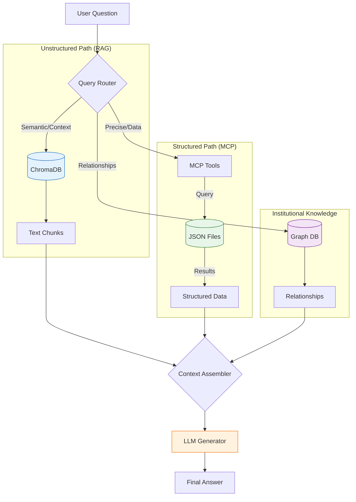

# Unified Local Nexus: RAG + Data Warehouse Architecture
- status: active
- type: plan
- id: unified-nexus
- last_checked: 2026-02-02
- label: ['planning']
<!-- content -->
This document proposes an architecture that unifies **RAG (Retrieval-Augmented Generation)** for unstructured data with **Data Warehouse + Text2SQL** for structured data. The result is a system that can answer questions requiring both semantic understanding and precise computation.

## The Core Insight
- status: active
- type: documentation
- id: unified-nexus.insight
- label: ['planning']
<!-- content -->
RAG and Data Warehouse approaches are **complementary, not competing**:

| Capability | RAG (Unstructured) | Data Warehouse (Structured) |
|:-----------|:-------------------|:----------------------------|
| **Data Type** | Documents, text, PDFs | Tables, CSVs, databases |
| **Query Style** | Semantic similarity | Exact SQL computation |
| **Strengths** | Fuzzy matching, context | Aggregations, joins, filters |
| **Weaknesses** | Can't compute, count | Can't understand meaning |
| **Example** | "What's our PTO policy?" | "How many sales in Q3?" |

**The gap**: Many real questions require BOTH:
- "Which product has the most complaints about shipping?" (semantic + aggregation)
- "Compare our revenue trends with what the market report says" (structured + unstructured)
- "Find customers who mentioned pricing concerns and have > $10K lifetime value" (semantic filter + computation)

This is the **TAG (Table-Augmented Generation)** paradigm emerging from Berkeley/Databricks research.

## Proposed Architecture
- status: active
- type: plan
- id: unified-nexus.architecture
- label: ['planning']
<!-- content -->
The unified system has three retrieval paths that feed into a single LLM for answer generation:

```
                          ┌─────────────────────────────────────┐
                          │           User Question             │
                          └──────────────┬──────────────────────┘
                                         │
                                         ▼
                          ┌─────────────────────────────────────┐
                          │         Query Router (LLM)          │
                          │  Classifies: structured/unstructured│
                          │              /hybrid                │
                          └──────────────┬──────────────────────┘
                                         │
              ┌──────────────────────────┼──────────────────────────┐
              │                          │                          │
              ▼                          ▼                          ▼
    ┌─────────────────┐      ┌─────────────────┐      ┌─────────────────┐
    │   Vector Store  │      │    DuckDB       │      │   Hybrid Path   │
    │   (ChromaDB)    │      │  (Text2SQL)     │      │  (Both + Join)  │
    │                 │      │                 │      │                 │
    │  Unstructured   │      │   Structured    │      │   Combined      │
    │  Documents      │      │   Tables        │      │   Reasoning     │
    └────────┬────────┘      └────────┬────────┘      └────────┬────────┘
             │                        │                        │
             └────────────────────────┼────────────────────────┘
                                      │
                                      ▼
                          ┌─────────────────────────────────────┐
                          │     Context Assembly & Generation   │
                          │  (LLM synthesizes all retrieved     │
                          │   information into final answer)    │
                          └─────────────────────────────────────┘
```

### Current Implementation (Simplified Nexus)
- status: active
- type: documentation
- id: unified-nexus.architecture.simplified_diagram
- label: ['planning']
<!-- content -->
While the full vision includes a text-to-SQL engine (DuckDB), the current implementation simplifies this by using **MCP Tools** to query structured JSON data.



### Component Summary
- status: active
- type: documentation
- id: unified-nexus.architecture.components
- label: ['planning']
<!-- content -->

| Component | Technology | Purpose |
|:----------|:-----------|:--------|
| **Document Store** | ChromaDB | Vector embeddings for semantic search |
| **Data Warehouse** | DuckDB | SQL queries over structured data |
| **Query Router** | LLM (cheap model) | Classify query type, route appropriately |
| **Text2SQL Engine** | LLM + schema context | Generate SQL from natural language |
| **Hybrid Executor** | Custom orchestrator | Combine SQL results with semantic search |
| **Answer Generator** | LLM (quality model) | Synthesize final response |

### Vector Store Alternatives
- status: active
- type: documentation
- id: unified-nexus.architecture.vector-alternatives
- last_checked: 2026-01-29
- label: ['planning']
<!-- content -->
ChromaDB was selected for this implementation, but these alternatives are documented for future reference:

| Option | Pros | Cons | When to Use |
|:-------|:-----|:-----|:------------|
| **ChromaDB** ⭐ | Local, lightweight, Python-native | Single-node only | Default choice, prototyping |
| **LanceDB** | Columnar, fast, embedded | Newer ecosystem | High-volume analytics |
| **pgvector** | SQL integration, familiar | Requires PostgreSQL | Consolidating to Postgres |
| **Pinecone** | Managed, scalable, reliable | Cloud-only, costs money | Enterprise scale |
| **Pinecone** | Managed, scalable, reliable | Cloud-only, costs money | Enterprise scale |
| **Weaviate** | GraphQL, rich features | Heavier setup | Complex schema needs |

### System Resilience & Error Handling
- status: active
- type: guideline
- id: unified-nexus.architecture.resilience
- label: ['planning', 'protocol']
<!-- content -->
> [!WARNING]
> **Internal Blocking Risk**: In a unified system, a failure in one component (e.g., VectorStore initialization) must not crash the entire application. 
> 
> **Architectural Constraint**: 
> - Lazy loading is preferred for heavy components.
> - **Initialization Retries**: The UI must handle "soft failures" by allowing components to re-initialize on subsequent interactions rather than caching a permanent `None` state.
> - **Isolated Scope**: Component errors should be trapped at the component boundary to prevent propagating effectively "blocking" states to the UI event loop.

## Implementation Plan
- status: active
- type: plan
- id: unified-nexus.implementation
- label: ['planning']
<!-- content -->
Starting from the existing `local_nexus` codebase (DuckDB + Streamlit), add RAG capabilities incrementally.

### Phase 1: Add Vector Store
- status: todo
- type: task
- id: unified-nexus.implementation.phase1
- priority: high
- estimate: 2h
- label: ['planning']
<!-- content -->
Add ChromaDB alongside DuckDB to store document embeddings.

**File: `src/core/vector_store.py`**

```python
"""
Vector store for unstructured document storage and retrieval.

This module adds RAG capabilities to the Local Nexus data warehouse,
enabling semantic search over documents alongside SQL queries.
"""

import chromadb
from chromadb.utils import embedding_functions
from pathlib import Path
from typing import Optional
import hashlib


class VectorStore:
    """
    Manages vector embeddings for unstructured documents.
    
    Uses ChromaDB with sentence-transformers for local embedding generation.
    Supports document ingestion, deduplication, and semantic search.
    """
    
    def __init__(self, persist_directory: str = "data/vectordb"):
        """
        Initialize the vector store.
        
        Args:
            persist_directory: Path to persist ChromaDB data
        """
        self.persist_dir = Path(persist_directory)
        self.persist_dir.mkdir(parents=True, exist_ok=True)
        
        # Initialize ChromaDB with persistence
        self.client = chromadb.PersistentClient(path=str(self.persist_dir))
        
        # Use a local embedding model (no API costs)
        self.embedding_fn = embedding_functions.SentenceTransformerEmbeddingFunction(
            model_name="all-MiniLM-L6-v2"
        )
        
        # Create or get the main collection
        self.collection = self.client.get_or_create_collection(
            name="documents",
            embedding_function=self.embedding_fn,
            metadata={"hnsw:space": "cosine"}
        )
    
    def _hash_content(self, content: str) -> str:
        """Generate SHA-256 hash for content deduplication."""
        return hashlib.sha256(content.encode()).hexdigest()
    
    def add_document(
        self, 
        content: str, 
        metadata: Optional[dict] = None,
        doc_id: Optional[str] = None
    ) -> str:
        """
        Add a document to the vector store.
        
        Args:
            content: Document text content
            metadata: Optional metadata dict (source, date, type, etc.)
            doc_id: Optional explicit ID (generated from hash if not provided)
        
        Returns:
            The document ID (either provided or generated)
        """
        # Generate ID from content hash if not provided
        if doc_id is None:
            doc_id = self._hash_content(content)
        
        # Check for duplicates
        existing = self.collection.get(ids=[doc_id])
        if existing['ids']:
            return doc_id  # Already exists, skip
        
        # Add to collection
        self.collection.add(
            documents=[content],
            metadatas=[metadata or {}],
            ids=[doc_id]
        )
        
        return doc_id
    
    def add_chunks(
        self, 
        chunks: list[str], 
        metadatas: Optional[list[dict]] = None,
        source_id: Optional[str] = None
    ) -> list[str]:
        """
        Add multiple document chunks to the vector store.
        
        Args:
            chunks: List of text chunks
            metadatas: Optional list of metadata dicts (one per chunk)
            source_id: Optional source document identifier
        
        Returns:
            List of chunk IDs
        """
        ids = []
        metas = metadatas or [{}] * len(chunks)
        
        for i, (chunk, meta) in enumerate(zip(chunks, metas)):
            # Add source tracking to metadata
            chunk_meta = {**meta}
            if source_id:
                chunk_meta['source_id'] = source_id
                chunk_meta['chunk_index'] = i
            
            chunk_id = self.add_document(chunk, chunk_meta)
            ids.append(chunk_id)
        
        return ids
    
    def search(
        self, 
        query: str, 
        top_k: int = 5,
        where: Optional[dict] = None
    ) -> list[dict]:
        """
        Semantic search for relevant documents.
        
        Args:
            query: Search query
            top_k: Number of results to return
            where: Optional ChromaDB where filter
        
        Returns:
            List of dicts with 'id', 'text', 'metadata', 'distance'
        """
        results = self.collection.query(
            query_texts=[query],
            n_results=top_k,
            where=where
        )
        
        # Flatten results into list of dicts
        documents = []
        for i in range(len(results['ids'][0])):
            documents.append({
                'id': results['ids'][0][i],
                'text': results['documents'][0][i],
                'metadata': results['metadatas'][0][i] if results['metadatas'] else {},
                'distance': results['distances'][0][i] if results['distances'] else None
            })
        
        return documents
    
    def get_stats(self) -> dict:
        """Get collection statistics."""
        return {
            'total_documents': self.collection.count(),
            'persist_directory': str(self.persist_dir)
        }
```

### Phase 2: Query Router
- status: todo
- type: task
- id: unified-nexus.implementation.phase2
- priority: high
- estimate: 1h
- blocked_by: [unified-nexus.implementation.phase1]
- label: ['planning']
<!-- content -->
Classify incoming queries to route them to the appropriate retrieval path.

**File: `src/core/query_router.py`**

```python
"""
Query router for the unified RAG + Data Warehouse system.

Classifies queries and routes them to the appropriate retrieval path:
- Structured: SQL queries over DuckDB tables
- Unstructured: Semantic search over ChromaDB documents
- Hybrid: Both paths combined
"""

from enum import Enum
from typing import Optional
import re


class QueryType(Enum):
    """Classification of query types."""
    STRUCTURED = "structured"      # Pure SQL/computation
    UNSTRUCTURED = "unstructured"  # Pure semantic/document search
    HYBRID = "hybrid"              # Requires both


class QueryRouter:
    """
    Routes queries to the appropriate retrieval system.
    
    Uses a combination of heuristics and LLM classification
    to determine the optimal retrieval path.
    """
    
    # Keywords that strongly suggest structured queries
    STRUCTURED_KEYWORDS = {
        'how many', 'count', 'total', 'sum', 'average', 'avg',
        'maximum', 'minimum', 'max', 'min', 'top', 'bottom',
        'percentage', 'percent', 'ratio', 'compare numbers',
        'sales', 'revenue', 'cost', 'profit', 'quantity',
        'between dates', 'last month', 'this year', 'q1', 'q2', 'q3', 'q4',
        'group by', 'per', 'each', 'breakdown'
    }
    
    # Keywords that strongly suggest unstructured queries
    UNSTRUCTURED_KEYWORDS = {
        'what is', 'explain', 'describe', 'why', 'how does',
        'policy', 'procedure', 'guideline', 'documentation',
        'meaning', 'definition', 'concept', 'overview',
        'tell me about', 'information on', 'details about'
    }
    
    # Keywords suggesting hybrid queries
    HYBRID_KEYWORDS = {
        'which', 'who', 'find', 'identify', 'list',
        'mentioned', 'related to', 'about', 'with',
        'complaints', 'feedback', 'reviews', 'comments',
        'and also', 'as well as', 'combined with'
    }
    
    def __init__(self, llm_client=None, use_llm: bool = True):
        """
        Initialize the query router.
        
        Args:
            llm_client: Optional LLM client for classification
            use_llm: Whether to use LLM for ambiguous cases
        """
        self.llm_client = llm_client
        self.use_llm = use_llm and llm_client is not None
    
    def _heuristic_classify(self, query: str) -> tuple[QueryType, float]:
        """
        Classify query using keyword heuristics.
        
        Args:
            query: User query string
        
        Returns:
            Tuple of (QueryType, confidence score 0-1)
        """
        query_lower = query.lower()
        
        # Count keyword matches
        structured_score = sum(
            1 for kw in self.STRUCTURED_KEYWORDS 
            if kw in query_lower
        )
        unstructured_score = sum(
            1 for kw in self.UNSTRUCTURED_KEYWORDS 
            if kw in query_lower
        )
        hybrid_score = sum(
            1 for kw in self.HYBRID_KEYWORDS 
            if kw in query_lower
        )
        
        total = structured_score + unstructured_score + hybrid_score + 0.1
        
        # Determine type based on scores
        if hybrid_score > 0 and (structured_score > 0 or unstructured_score > 0):
            return QueryType.HYBRID, hybrid_score / total
        elif structured_score > unstructured_score:
            return QueryType.STRUCTURED, structured_score / total
        elif unstructured_score > structured_score:
            return QueryType.UNSTRUCTURED, unstructured_score / total
        else:
            # Ambiguous - default to hybrid for safety
            return QueryType.HYBRID, 0.3
    
    def _llm_classify(self, query: str) -> QueryType:
        """
        Use LLM to classify ambiguous queries.
        
        Args:
            query: User query string
        
        Returns:
            QueryType classification
        """
        if not self.llm_client:
            return QueryType.HYBRID
        
        prompt = f"""Classify this query into one of three categories:

Query: "{query}"

Categories:
- STRUCTURED: Requires numerical computation, aggregation, counting, or SQL-like operations over tabular data
- UNSTRUCTURED: Requires finding information in documents, policies, or text content
- HYBRID: Requires both computation on data AND understanding of text/documents

Respond with ONLY one word: STRUCTURED, UNSTRUCTURED, or HYBRID"""
        
        response = self.llm_client.generate_content(prompt)
        result = response.text.strip().upper()
        
        if 'STRUCTURED' in result:
            return QueryType.STRUCTURED
        elif 'UNSTRUCTURED' in result:
            return QueryType.UNSTRUCTURED
        else:
            return QueryType.HYBRID
    
    def classify(self, query: str) -> QueryType:
        """
        Classify a query to determine the retrieval path.
        
        Args:
            query: User query string
        
        Returns:
            QueryType indicating the recommended retrieval path
        """
        # First, try heuristic classification
        query_type, confidence = self._heuristic_classify(query)
        
        # If confident enough, use heuristic result
        if confidence > 0.5:
            return query_type
        
        # Otherwise, use LLM if available
        if self.use_llm:
            return self._llm_classify(query)
        
        # Default to hybrid for safety
        return query_type
    
    def get_classification_details(self, query: str) -> dict:
        """
        Get detailed classification information for debugging.
        
        Args:
            query: User query string
        
        Returns:
            Dict with classification details
        """
        query_type, confidence = self._heuristic_classify(query)
        
        return {
            'query': query,
            'heuristic_type': query_type.value,
            'heuristic_confidence': confidence,
            'final_type': self.classify(query).value,
            'used_llm': confidence <= 0.5 and self.use_llm
        }
```

### Phase 3: Text2SQL Engine
- status: todo
- type: task
- id: unified-nexus.implementation.phase3
- priority: high
- estimate: 2h
- blocked_by: [unified-nexus.implementation.phase2]
- label: ['planning']
<!-- content -->
Generate SQL queries from natural language using schema context.

**File: `src/core/text2sql.py`**

```python
"""
Text-to-SQL engine for the Local Nexus data warehouse.

Converts natural language queries into SQL that can be executed
against DuckDB. Uses schema information and example queries
for accurate generation.
"""

import duckdb
from typing import Optional
import json


class Text2SQLEngine:
    """
    Converts natural language to SQL queries.
    
    Uses the database schema and optional example queries
    to generate accurate SQL. Includes validation and
    error handling for generated queries.
    """
    
    def __init__(self, db_path: str, llm_client):
        """
        Initialize the Text2SQL engine.
        
        Args:
            db_path: Path to DuckDB database file
            llm_client: LLM client for SQL generation
        """
        self.db_path = db_path
        self.llm = llm_client
        self._schema_cache = None
    
    def _get_connection(self) -> duckdb.DuckDBPyConnection:
        """Get a DuckDB connection."""
        return duckdb.connect(self.db_path, read_only=True)
    
    def get_schema(self, force_refresh: bool = False) -> dict:
        """
        Get the database schema for all tables.
        
        Args:
            force_refresh: Force refresh the cached schema
        
        Returns:
            Dict mapping table names to column info
        """
        if self._schema_cache and not force_refresh:
            return self._schema_cache
        
        schema = {}
        
        with self._get_connection() as conn:
            # Get all tables
            tables = conn.execute(
                "SELECT table_name FROM information_schema.tables WHERE table_schema = 'main'"
            ).fetchall()
            
            for (table_name,) in tables:
                # Get column info for each table
                columns = conn.execute(f"""
                    SELECT column_name, data_type, is_nullable
                    FROM information_schema.columns
                    WHERE table_name = '{table_name}'
                """).fetchall()
                
                schema[table_name] = [
                    {
                        'name': col[0],
                        'type': col[1],
                        'nullable': col[2] == 'YES'
                    }
                    for col in columns
                ]
                
                # Get sample values for better context
                try:
                    sample = conn.execute(
                        f"SELECT * FROM {table_name} LIMIT 3"
                    ).fetchdf()
                    schema[table_name + '_sample'] = sample.to_dict('records')
                except Exception:
                    pass
        
        self._schema_cache = schema
        return schema
    
    def _format_schema_for_prompt(self) -> str:
        """Format schema information for the LLM prompt."""
        schema = self.get_schema()
        
        lines = ["Database Schema:"]
        for table_name, columns in schema.items():
            if table_name.endswith('_sample'):
                continue
            
            lines.append(f"\nTable: {table_name}")
            lines.append("Columns:")
            for col in columns:
                nullable = " (nullable)" if col['nullable'] else ""
                lines.append(f"  - {col['name']}: {col['type']}{nullable}")
            
            # Add sample if available
            sample_key = table_name + '_sample'
            if sample_key in schema and schema[sample_key]:
                lines.append(f"Sample data: {json.dumps(schema[sample_key][:2], default=str)}")
        
        return "\n".join(lines)
    
    def generate_sql(self, question: str) -> tuple[str, str]:
        """
        Generate SQL from a natural language question.
        
        Args:
            question: Natural language question
        
        Returns:
            Tuple of (sql_query, explanation)
        """
        schema_text = self._format_schema_for_prompt()
        
        prompt = f"""{schema_text}

User Question: "{question}"

Generate a DuckDB SQL query to answer this question.

Rules:
1. Use only tables and columns that exist in the schema
2. Use DuckDB syntax (similar to PostgreSQL)
3. Include appropriate JOINs if multiple tables are needed
4. Use meaningful column aliases for readability
5. Limit results to 100 rows unless aggregating

Respond in this exact format:
SQL:
```sql
YOUR_QUERY_HERE
```
EXPLANATION: Brief explanation of what the query does"""
        
        response = self.llm.generate_content(prompt)
        text = response.text
        
        # Parse SQL from response
        sql = ""
        explanation = ""
        
        if "```sql" in text:
            start = text.find("```sql") + 6
            end = text.find("```", start)
            sql = text[start:end].strip()
        elif "```" in text:
            start = text.find("```") + 3
            end = text.find("```", start)
            sql = text[start:end].strip()
        
        if "EXPLANATION:" in text:
            explanation = text.split("EXPLANATION:")[-1].strip()
        
        return sql, explanation
    
    def execute_sql(self, sql: str) -> tuple[list[dict], Optional[str]]:
        """
        Execute a SQL query and return results.
        
        Args:
            sql: SQL query to execute
        
        Returns:
            Tuple of (results as list of dicts, error message if any)
        """
        try:
            with self._get_connection() as conn:
                df = conn.execute(sql).fetchdf()
                return df.to_dict('records'), None
        except Exception as e:
            return [], str(e)
    
    def query(self, question: str) -> dict:
        """
        Full pipeline: question -> SQL -> results.
        
        Args:
            question: Natural language question
        
        Returns:
            Dict with sql, explanation, results, and any errors
        """
        # Generate SQL
        sql, explanation = self.generate_sql(question)
        
        if not sql:
            return {
                'success': False,
                'error': 'Could not generate SQL from question',
                'sql': None,
                'explanation': None,
                'results': []
            }
        
        # Execute SQL
        results, error = self.execute_sql(sql)
        
        return {
            'success': error is None,
            'sql': sql,
            'explanation': explanation,
            'results': results,
            'error': error
        }
```

### Phase 4: Unified Engine
- status: todo
- type: task
- id: unified-nexus.implementation.phase4
- priority: high
- estimate: 3h
- blocked_by: [unified-nexus.implementation.phase3]
- label: ['planning']
<!-- content -->
Combine all components into a unified query engine.

**File: `src/core/unified_engine.py`**

```python
"""
Unified RAG + Data Warehouse engine.

This is the main orchestrator that combines:
- Query routing (classify query type)
- Vector store (semantic search for documents)
- Text2SQL (SQL queries for structured data)
- Answer generation (synthesize final response)
"""

from typing import Optional
from .vector_store import VectorStore
from .text2sql import Text2SQLEngine
from .query_router import QueryRouter, QueryType


class UnifiedEngine:
    """
    Unified query engine combining RAG and Data Warehouse capabilities.
    
    Routes queries to the appropriate retrieval path(s) and
    synthesizes a final answer from the retrieved context.
    """
    
    def __init__(
        self,
        db_path: str,
        vector_store_path: str,
        llm_client,
        cheap_llm_client=None
    ):
        """
        Initialize the unified engine.
        
        Args:
            db_path: Path to DuckDB database
            vector_store_path: Path to ChromaDB persistence
            llm_client: LLM client for answer generation
            cheap_llm_client: Optional cheaper LLM for routing/SQL
        """
        self.llm = llm_client
        self.cheap_llm = cheap_llm_client or llm_client
        
        # Initialize components
        self.vector_store = VectorStore(vector_store_path)
        self.text2sql = Text2SQLEngine(db_path, self.cheap_llm)
        self.router = QueryRouter(self.cheap_llm)
    
    def _retrieve_structured(self, question: str) -> dict:
        """
        Retrieve context via Text2SQL.
        
        Args:
            question: User question
        
        Returns:
            Dict with SQL results and metadata
        """
        result = self.text2sql.query(question)
        
        return {
            'type': 'structured',
            'success': result['success'],
            'sql': result.get('sql'),
            'data': result.get('results', []),
            'explanation': result.get('explanation'),
            'error': result.get('error')
        }
    
    def _retrieve_unstructured(self, question: str, top_k: int = 5) -> dict:
        """
        Retrieve context via semantic search.
        
        Args:
            question: User question
            top_k: Number of documents to retrieve
        
        Returns:
            Dict with retrieved documents
        """
        documents = self.vector_store.search(question, top_k=top_k)
        
        return {
            'type': 'unstructured',
            'success': len(documents) > 0,
            'documents': documents,
            'error': None if documents else 'No relevant documents found'
        }
    
    def _retrieve_hybrid(self, question: str) -> dict:
        """
        Retrieve context from both structured and unstructured sources.
        
        Args:
            question: User question
        
        Returns:
            Dict with combined results
        """
        structured = self._retrieve_structured(question)
        unstructured = self._retrieve_unstructured(question)
        
        return {
            'type': 'hybrid',
            'structured': structured,
            'unstructured': unstructured,
            'success': structured['success'] or unstructured['success']
        }
    
    def _format_context(self, retrieval_result: dict) -> str:
        """
        Format retrieved context for the answer generation prompt.
        
        Args:
            retrieval_result: Result from one of the retrieve methods
        
        Returns:
            Formatted context string
        """
        lines = []
        
        if retrieval_result['type'] == 'structured':
            if retrieval_result['success']:
                lines.append("=== DATABASE QUERY RESULTS ===")
                lines.append(f"SQL: {retrieval_result['sql']}")
                lines.append(f"Explanation: {retrieval_result['explanation']}")
                lines.append(f"Data ({len(retrieval_result['data'])} rows):")
                
                # Format data as readable table
                for i, row in enumerate(retrieval_result['data'][:20]):
                    lines.append(f"  {i+1}. {row}")
                
                if len(retrieval_result['data']) > 20:
                    lines.append(f"  ... and {len(retrieval_result['data']) - 20} more rows")
            else:
                lines.append(f"Database query failed: {retrieval_result['error']}")
        
        elif retrieval_result['type'] == 'unstructured':
            if retrieval_result['success']:
                lines.append("=== DOCUMENT SEARCH RESULTS ===")
                for i, doc in enumerate(retrieval_result['documents']):
                    lines.append(f"\n--- Document {i+1} ---")
                    if doc.get('metadata'):
                        lines.append(f"Source: {doc['metadata']}")
                    lines.append(doc['text'])
            else:
                lines.append("No relevant documents found.")
        
        elif retrieval_result['type'] == 'hybrid':
            # Format both structured and unstructured
            lines.append(self._format_context(retrieval_result['structured']))
            lines.append("\n")
            lines.append(self._format_context(retrieval_result['unstructured']))
        
        return "\n".join(lines)
    
    def _generate_answer(self, question: str, context: str, query_type: QueryType) -> str:
        """
        Generate final answer from retrieved context.
        
        Args:
            question: Original user question
            context: Formatted retrieval context
            query_type: Type of query (for tailored instructions)
        
        Returns:
            Generated answer string
        """
        type_instructions = {
            QueryType.STRUCTURED: "Focus on the numerical data and computations. Be precise with numbers.",
            QueryType.UNSTRUCTURED: "Synthesize information from the documents. Quote relevant passages.",
            QueryType.HYBRID: "Combine insights from both the data and documents. Connect numerical findings with contextual information."
        }
        
        prompt = f"""Answer the user's question based on the retrieved information.

Question: {question}

Retrieved Context:
{context}

Instructions:
- {type_instructions.get(query_type, '')}
- If the context doesn't contain enough information, say so clearly
- Cite specific data points or document sources when relevant
- Be concise but thorough

Your answer:"""
        
        response = self.llm.generate_content(prompt)
        return response.text
    
    def query(self, question: str) -> dict:
        """
        Process a user question through the unified system.
        
        This is the main entry point. It:
        1. Classifies the query type
        2. Routes to appropriate retrieval path(s)
        3. Generates a synthesized answer
        
        Args:
            question: User's natural language question
        
        Returns:
            Dict with answer and metadata
        """
        # Step 1: Classify the query
        query_type = self.router.classify(question)
        
        # Step 2: Retrieve context based on type
        if query_type == QueryType.STRUCTURED:
            retrieval = self._retrieve_structured(question)
        elif query_type == QueryType.UNSTRUCTURED:
            retrieval = self._retrieve_unstructured(question)
        else:  # HYBRID
            retrieval = self._retrieve_hybrid(question)
        
        # Step 3: Format context
        context = self._format_context(retrieval)
        
        # Step 4: Generate answer
        answer = self._generate_answer(question, context, query_type)
        
        return {
            'question': question,
            'query_type': query_type.value,
            'retrieval': retrieval,
            'context_summary': context[:500] + '...' if len(context) > 500 else context,
            'answer': answer
        }
    
    def get_system_stats(self) -> dict:
        """Get statistics about the unified system."""
        return {
            'vector_store': self.vector_store.get_stats(),
            'database_schema': list(self.text2sql.get_schema().keys())
        }
```

### Phase 5: Document Ingestion Pipeline
- status: todo
- type: task
- id: unified-nexus.implementation.phase5
- priority: medium
- estimate: 2h
- blocked_by: [unified-nexus.implementation.phase1]
- label: ['planning']
<!-- content -->
Add document ingestion to complement the existing CSV/Excel ingestion.

**File: `src/core/document_ingestion.py`**

```python
"""
Document ingestion pipeline for the unified Local Nexus.

Handles ingestion of unstructured documents (PDF, TXT, DOCX, MD)
into the vector store, with chunking and metadata extraction.
"""

from pathlib import Path
from typing import Optional
import hashlib
import re


class DocumentChunker:
    """
    Chunks documents into smaller pieces for embedding.
    
    Supports multiple chunking strategies based on document type.
    """
    
    def __init__(self, chunk_size: int = 500, overlap: int = 50):
        """
        Initialize the chunker.
        
        Args:
            chunk_size: Target chunk size in tokens (approximate)
            overlap: Number of tokens to overlap between chunks
        """
        self.chunk_size = chunk_size
        self.overlap = overlap
    
    def _estimate_tokens(self, text: str) -> int:
        """Rough token estimation (4 chars ≈ 1 token)."""
        return len(text) // 4
    
    def chunk_by_size(self, text: str) -> list[str]:
        """
        Chunk text by fixed size with overlap.
        
        Args:
            text: Input text
        
        Returns:
            List of text chunks
        """
        # Convert target tokens to chars
        char_size = self.chunk_size * 4
        char_overlap = self.overlap * 4
        
        chunks = []
        start = 0
        
        while start < len(text):
            end = start + char_size
            
            # Try to break at sentence boundary
            if end < len(text):
                # Look for sentence end within last 20% of chunk
                search_start = end - int(char_size * 0.2)
                search_region = text[search_start:end]
                
                # Find last sentence boundary
                for pattern in ['. ', '.\n', '? ', '! ']:
                    last_boundary = search_region.rfind(pattern)
                    if last_boundary != -1:
                        end = search_start + last_boundary + len(pattern)
                        break
            
            chunk = text[start:end].strip()
            if chunk:
                chunks.append(chunk)
            
            start = end - char_overlap
        
        return chunks
    
    def chunk_by_headers(self, text: str) -> list[str]:
        """
        Chunk markdown/text by headers.
        
        Useful for structured documents where each section
        should be its own chunk.
        
        Args:
            text: Input text with headers
        
        Returns:
            List of text chunks (one per section)
        """
        # Split on markdown headers
        pattern = r'(^#{1,6}\s+.+$)'
        parts = re.split(pattern, text, flags=re.MULTILINE)
        
        chunks = []
        current_chunk = ""
        
        for part in parts:
            if re.match(r'^#{1,6}\s+', part):
                # This is a header - start new chunk
                if current_chunk.strip():
                    chunks.append(current_chunk.strip())
                current_chunk = part + "\n"
            else:
                current_chunk += part
        
        # Don't forget the last chunk
        if current_chunk.strip():
            chunks.append(current_chunk.strip())
        
        # If chunks are too big, split them further
        final_chunks = []
        for chunk in chunks:
            if self._estimate_tokens(chunk) > self.chunk_size * 1.5:
                final_chunks.extend(self.chunk_by_size(chunk))
            else:
                final_chunks.append(chunk)
        
        return final_chunks


class DocumentIngester:
    """
    Ingests documents into the vector store.
    
    Handles file reading, metadata extraction, chunking,
    and deduplication.
    """
    
    def __init__(self, vector_store, chunker: Optional[DocumentChunker] = None):
        """
        Initialize the ingester.
        
        Args:
            vector_store: VectorStore instance
            chunker: Optional custom chunker
        """
        self.vector_store = vector_store
        self.chunker = chunker or DocumentChunker()
    
    def _read_file(self, file_path: Path) -> tuple[str, str]:
        """
        Read file content based on extension.
        
        Args:
            file_path: Path to file
        
        Returns:
            Tuple of (content, file_type)
        """
        suffix = file_path.suffix.lower()
        
        if suffix == '.txt' or suffix == '.md':
            with open(file_path, 'r', encoding='utf-8') as f:
                return f.read(), suffix[1:]
        
        elif suffix == '.pdf':
            try:
                import pypdf
                reader = pypdf.PdfReader(str(file_path))
                text = "\n".join(page.extract_text() for page in reader.pages)
                return text, 'pdf'
            except ImportError:
                raise ImportError("pypdf required for PDF ingestion: pip install pypdf")
        
        elif suffix == '.docx':
            try:
                from docx import Document
                doc = Document(str(file_path))
                text = "\n".join(para.text for para in doc.paragraphs)
                return text, 'docx'
            except ImportError:
                raise ImportError("python-docx required for DOCX ingestion: pip install python-docx")
        
        else:
            raise ValueError(f"Unsupported file type: {suffix}")
    
    def _generate_doc_id(self, content: str) -> str:
        """Generate unique document ID from content hash."""
        return hashlib.sha256(content.encode()).hexdigest()[:16]
    
    def ingest_file(self, file_path: str | Path) -> dict:
        """
        Ingest a single file into the vector store.
        
        Args:
            file_path: Path to the file
        
        Returns:
            Dict with ingestion results
        """
        file_path = Path(file_path)
        
        if not file_path.exists():
            return {'success': False, 'error': f'File not found: {file_path}'}
        
        # Read file
        try:
            content, file_type = self._read_file(file_path)
        except Exception as e:
            return {'success': False, 'error': str(e)}
        
        # Generate document ID
        doc_id = self._generate_doc_id(content)
        
        # Choose chunking strategy
        if file_type == 'md':
            chunks = self.chunker.chunk_by_headers(content)
        else:
            chunks = self.chunker.chunk_by_size(content)
        
        # Prepare metadata
        base_metadata = {
            'source_file': file_path.name,
            'file_type': file_type,
            'source_path': str(file_path),
            'total_chunks': len(chunks)
        }
        
        # Ingest chunks
        chunk_ids = self.vector_store.add_chunks(
            chunks=chunks,
            metadatas=[{**base_metadata, 'chunk_index': i} for i in range(len(chunks))],
            source_id=doc_id
        )
        
        return {
            'success': True,
            'document_id': doc_id,
            'file_name': file_path.name,
            'file_type': file_type,
            'chunks_created': len(chunk_ids),
            'chunk_ids': chunk_ids
        }
    
    def ingest_directory(self, directory: str | Path, extensions: list[str] = None) -> list[dict]:
        """
        Ingest all matching files in a directory.
        
        Args:
            directory: Path to directory
            extensions: List of extensions to process (default: all supported)
        
        Returns:
            List of ingestion results
        """
        directory = Path(directory)
        extensions = extensions or ['.txt', '.md', '.pdf', '.docx']
        
        results = []
        for ext in extensions:
            for file_path in directory.glob(f'**/*{ext}'):
                result = self.ingest_file(file_path)
                results.append(result)
        
        return results
```

## Usage Examples
- status: active
- type: documentation
- id: unified-nexus.examples
- label: ['planning']
<!-- content -->
Examples of using the unified system.

### Basic Usage
- id: unified_local_nexus_rag_data_warehouse_architecture.usage_examples.basic_usage
- status: active
- type: documentation
- last_checked: 2026-01-27
- label: ['planning']
<!-- content -->

```python
from src.core.unified_engine import UnifiedEngine
import google.generativeai as genai

# Configure LLM
- id: configure_llm
- status: active
- type: documentation
- last_checked: 2026-01-27
- label: ['planning']
<!-- content -->
genai.configure(api_key="your-api-key")
llm = genai.GenerativeModel('gemini-1.5-flash')

# Initialize unified engine
- id: initialize_unified_engine
- status: active
- type: documentation
- last_checked: 2026-01-27
- label: ['planning']
<!-- content -->
engine = UnifiedEngine(
    db_path="data/warehouse.db",
    vector_store_path="data/vectordb",
    llm_client=llm
)

# Query examples
- id: query_examples
- status: active
- type: documentation
- last_checked: 2026-01-27
- label: ['planning']
<!-- content -->
# Structured query (routes to Text2SQL)
- id: structured_query_routes_to_text2sql
- status: active
- type: documentation
- last_checked: 2026-01-27
- label: ['planning']
<!-- content -->
result = engine.query("What were our total sales last month?")
print(result['answer'])

# Unstructured query (routes to RAG)
- id: unstructured_query_routes_to_rag
- status: active
- type: documentation
- last_checked: 2026-01-27
- label: ['planning']
<!-- content -->
result = engine.query("What is our refund policy?")
print(result['answer'])

# Hybrid query (uses both)
- id: hybrid_query_uses_both
- status: active
- type: documentation
- last_checked: 2026-01-27
- label: ['planning']
<!-- content -->
result = engine.query("Which customers complained about shipping and have orders over $500?")
print(result['answer'])
```

### Document Ingestion
- id: hybrid_query_uses_both.document_ingestion
- status: active
- type: documentation
- last_checked: 2026-01-27
- label: ['planning']
<!-- content -->

```python
from src.core.document_ingestion import DocumentIngester
from src.core.vector_store import VectorStore

# Initialize
- id: initialize
- status: active
- type: documentation
- last_checked: 2026-01-27
- label: ['planning']
<!-- content -->
vector_store = VectorStore("data/vectordb")
ingester = DocumentIngester(vector_store)

# Ingest a single file
- id: ingest_a_single_file
- status: active
- type: documentation
- last_checked: 2026-01-27
- label: ['planning']
<!-- content -->
result = ingester.ingest_file("docs/company_policies.pdf")
print(f"Created {result['chunks_created']} chunks")

# Ingest all documents in a directory
- id: ingest_all_documents_in_a_directory
- status: active
- type: documentation
- last_checked: 2026-01-27
- label: ['planning']
<!-- content -->
results = ingester.ingest_directory("docs/", extensions=['.pdf', '.md'])
total_chunks = sum(r['chunks_created'] for r in results if r['success'])
print(f"Ingested {len(results)} files, {total_chunks} total chunks")
```

## Integration with Streamlit UI
- status: todo
- type: task
- id: unified-nexus.ui-integration
- priority: medium
- estimate: 2h
- blocked_by: [unified-nexus.implementation.phase4]
- label: ['planning']
<!-- content -->
Update the Streamlit app to support both data types.

**Add to `src/app.py`:**

```python
import streamlit as st
from src.core.unified_engine import UnifiedEngine
from src.core.document_ingestion import DocumentIngester

# Sidebar - Data Sources section
- id: sidebar_data_sources_section
- status: active
- type: documentation
- last_checked: 2026-01-27
- label: ['planning']
<!-- content -->
with st.sidebar:
    st.header("Data Sources")
    
    # Existing: Structured data upload
    st.subheader("📊 Structured Data")
    uploaded_csv = st.file_uploader(
        "Upload CSV/Excel", 
        type=['csv', 'xlsx', 'xls']
    )
    
    # New: Document upload
    st.subheader("📄 Documents")
    uploaded_docs = st.file_uploader(
        "Upload Documents",
        type=['pdf', 'txt', 'md', 'docx'],
        accept_multiple_files=True
    )
    
    if uploaded_docs:
        for doc in uploaded_docs:
            # Save and ingest
            with open(f"data/uploads/{doc.name}", "wb") as f:
                f.write(doc.getbuffer())
            result = ingester.ingest_file(f"data/uploads/{doc.name}")
            if result['success']:
                st.success(f"✓ {doc.name}: {result['chunks_created']} chunks")
            else:
                st.error(f"✗ {doc.name}: {result['error']}")
    
    # Show system stats
    st.divider()
    st.subheader("System Status")
    stats = engine.get_system_stats()
    st.metric("Documents", stats['vector_store']['total_documents'])
    st.metric("Tables", len(stats['database_schema']))

# Chat interface
- id: chat_interface
- status: active
- type: documentation
- last_checked: 2026-01-27
- label: ['planning']
<!-- content -->
if prompt := st.chat_input("Ask about your data or documents..."):
    with st.chat_message("user"):
        st.write(prompt)
    
    with st.chat_message("assistant"):
        with st.spinner("Thinking..."):
            result = engine.query(prompt)
        
        # Show query type badge
        type_colors = {
            'structured': '🔢',
            'unstructured': '📄',
            'hybrid': '🔀'
        }
        st.caption(f"{type_colors.get(result['query_type'], '')} Query type: {result['query_type']}")
        
        # Show answer
        st.write(result['answer'])
        
        # Expandable details
        with st.expander("View retrieval details"):
            st.json(result['retrieval'])
```

## Graph Data Integration
- status: active
- type: plan
- id: unified-nexus.graphs
- label: ['planning']
<!-- content -->
Graph data represents **relationships** between entities—something that neither traditional RAG nor SQL handles elegantly. Adding a graph layer completes the unified architecture, enabling questions like:

- "Who are the key influencers connected to our top customers?" (relationship traversal)
- "What's the shortest path between our supplier and this regulatory issue?" (path finding)
- "Show me all entities related to this compliance violation" (subgraph extraction)

### Why Graphs Matter
- status: active
- type: documentation
- id: unified-nexus.graphs.rationale
- label: ['planning']
<!-- content -->

| Data Type | Best For | Limitations |
|:----------|:---------|:------------|
| **Tables (SQL)** | Aggregations, filters, joins on known schemas | Poor at variable-depth relationships |
| **Documents (RAG)** | Semantic search, fuzzy matching | No explicit relationship modeling |
| **Graphs** | Relationship traversal, path finding, network analysis | Overkill for simple lookups |

**Real-world graph questions**:
- "Which departments have the most cross-team dependencies?"
- "Find all products affected if Supplier X fails"
- "What's the influence network around this key account?"

### Approach Comparison
- status: active
- type: documentation
- id: unified-nexus.graphs.approaches
- label: ['planning']
<!-- content -->

| Approach | Complexity | Cost | Best For | Recommendation |
|:---------|:-----------|:-----|:---------|:---------------|
| **Text Serialization** | Low | Free | Simple graphs, prototyping | ⭐ Start here |
| **Graph State in Markdown** | Low | Free | Agent protocols, small graphs | ⭐ Good for your MD conventions |
| **GraphRAG (Microsoft)** | Medium | LLM calls | Document synthesis, summaries | Consider for document-heavy use |
| **DuckDB Graph Extensions** | Medium | Free | SQL-integrated graphs | ⭐ Best fit for Local Nexus |
| **NetworkX + Embeddings** | Medium | Free | Analysis + ML | Good for network metrics |
| **Neo4j + MCP** | High | Neo4j license | Large enterprise graphs | Overkill for most SMBs |
| **GNN Embeddings** | High | Compute | ML on graph structure | Research/advanced only |

### Recommended Approach: Lightweight Graph Layer
- status: active
- type: guideline
- id: unified-nexus.graphs.recommended
- label: ['planning']
<!-- content -->

For a **cheap and feasible** implementation that fits with Local Nexus, I recommend a **tiered approach**:

1. **Tier 1 (Immediate)**: Text serialization + structured prompting
2. **Tier 2 (When needed)**: DuckDB graph tables + NetworkX analysis
3. **Tier 3 (Scale)**: Neo4j MCP server (only if graph queries dominate)

Most SMB use cases will be fully served by Tier 1 and Tier 2.

### Option 1: Text Serialization (Cheapest)
- status: active
- type: task
- id: unified-nexus.graphs.serialization
- priority: high
- estimate: 1h
- label: ['planning']
<!-- content -->

Serialize graph structures into LLM-friendly text. The LLM can reason about relationships directly from text descriptions.

**Serialization Formats**:

```python
"""
Graph serialization utilities for LLM consumption.

Multiple formats available depending on graph size and query type.
"""

from typing import Optional
import json


class GraphSerializer:
    """
    Serializes graph data into LLM-friendly text formats.
    
    Supports multiple output formats optimized for different
    query types and graph sizes.
    """
    
    @staticmethod
    def to_edge_list(edges: list[tuple[str, str, Optional[dict]]]) -> str:
        """
        Simple edge list format. Best for small graphs.
        
        Args:
            edges: List of (source, target, properties) tuples
        
        Returns:
            Edge list string
        
        Example output:
            Alice -> Bob [relationship: manager]
            Bob -> Carol [relationship: colleague]
        """
        lines = []
        for source, target, props in edges:
            if props:
                prop_str = ", ".join(f"{k}: {v}" for k, v in props.items())
                lines.append(f"{source} -> {target} [{prop_str}]")
            else:
                lines.append(f"{source} -> {target}")
        return "\n".join(lines)
    
    @staticmethod
    def to_natural_language(
        edges: list[tuple[str, str, Optional[dict]]],
        node_descriptions: Optional[dict[str, str]] = None
    ) -> str:
        """
        Natural language description. Best for LLM reasoning.
        
        Args:
            edges: List of (source, target, properties) tuples
            node_descriptions: Optional dict mapping node IDs to descriptions
        
        Returns:
            Natural language description
        
        Example output:
            Alice is the manager of Bob.
            Bob is a colleague of Carol.
            Alice is described as: Senior VP of Engineering.
        """
        lines = []
        
        # Describe nodes first if available
        if node_descriptions:
            lines.append("Entities:")
            for node_id, desc in node_descriptions.items():
                lines.append(f"- {node_id}: {desc}")
            lines.append("\nRelationships:")
        
        # Describe relationships
        for source, target, props in edges:
            rel_type = props.get('relationship', 'connected to') if props else 'connected to'
            lines.append(f"- {source} is {rel_type} {target}")
        
        return "\n".join(lines)
    
    @staticmethod
    def to_adjacency_description(
        nodes: list[str],
        edges: list[tuple[str, str, Optional[dict]]]
    ) -> str:
        """
        Adjacency-based description. Best for neighborhood queries.
        
        Args:
            nodes: List of node IDs
            edges: List of (source, target, properties) tuples
        
        Returns:
            Adjacency description
        
        Example output:
            Alice's connections:
              - manages: Bob
              - reports_to: CEO
            Bob's connections:
              - managed_by: Alice
              - colleagues: Carol, Dave
        """
        # Build adjacency map
        adjacency = {node: {'outgoing': [], 'incoming': []} for node in nodes}
        
        for source, target, props in edges:
            rel_type = props.get('relationship', 'connected') if props else 'connected'
            if source in adjacency:
                adjacency[source]['outgoing'].append((rel_type, target))
            if target in adjacency:
                adjacency[target]['incoming'].append((rel_type, source))
        
        lines = []
        for node, connections in adjacency.items():
            if connections['outgoing'] or connections['incoming']:
                lines.append(f"\n{node}'s connections:")
                for rel_type, target in connections['outgoing']:
                    lines.append(f"  → {rel_type}: {target}")
                for rel_type, source in connections['incoming']:
                    lines.append(f"  ← {rel_type} (from {source})")
        
        return "\n".join(lines)
    
    @staticmethod
    def to_cypher_patterns(edges: list[tuple[str, str, Optional[dict]]]) -> str:
        """
        Cypher-style patterns. Best for graph DB users or structured queries.
        
        Args:
            edges: List of (source, target, properties) tuples
        
        Returns:
            Cypher-like pattern string
        
        Example output:
            (Alice)-[:MANAGES]->(Bob)
            (Bob)-[:COLLEAGUE]->(Carol)
        """
        lines = []
        for source, target, props in edges:
            rel_type = props.get('relationship', 'CONNECTED').upper().replace(' ', '_') if props else 'CONNECTED'
            lines.append(f"({source})-[:{rel_type}]->({target})")
        return "\n".join(lines)
    
    @staticmethod
    def to_rdf_triples(edges: list[tuple[str, str, Optional[dict]]]) -> str:
        """
        RDF triple format. Best for semantic web integration.
        
        Args:
            edges: List of (source, target, properties) tuples
        
        Returns:
            RDF-style triples
        
        Example output:
            <Alice> <manages> <Bob> .
            <Bob> <colleague_of> <Carol> .
        """
        lines = []
        for source, target, props in edges:
            predicate = props.get('relationship', 'relatedTo') if props else 'relatedTo'
            predicate = predicate.replace(' ', '_')
            lines.append(f"<{source}> <{predicate}> <{target}> .")
        return "\n".join(lines)


def extract_subgraph_for_query(
    query: str,
    all_edges: list[tuple[str, str, Optional[dict]]],
    all_nodes: dict[str, dict],
    max_nodes: int = 20
) -> tuple[list[str], list[tuple]]:
    """
    Extract relevant subgraph based on query keywords.
    
    This is a simple keyword-based extraction. For production,
    consider using embeddings to find relevant nodes.
    
    Args:
        query: User query
        all_edges: Complete edge list
        all_nodes: Dict of node_id -> node_properties
        max_nodes: Maximum nodes to include
    
    Returns:
        Tuple of (relevant_node_ids, relevant_edges)
    """
    query_lower = query.lower()
    
    # Find nodes mentioned in query or matching keywords
    relevant_nodes = set()
    for node_id, props in all_nodes.items():
        # Check if node ID or any property matches query
        searchable = f"{node_id} {json.dumps(props)}".lower()
        if any(word in searchable for word in query_lower.split()):
            relevant_nodes.add(node_id)
    
    # Expand to neighbors (1-hop)
    for source, target, _ in all_edges:
        if source in relevant_nodes:
            relevant_nodes.add(target)
        if target in relevant_nodes:
            relevant_nodes.add(source)
    
    # Limit size
    relevant_nodes = list(relevant_nodes)[:max_nodes]
    
    # Filter edges to only those between relevant nodes
    relevant_edges = [
        (s, t, p) for s, t, p in all_edges
        if s in relevant_nodes and t in relevant_nodes
    ]
    
    return relevant_nodes, relevant_edges
```

**Usage in Prompts**:

```python
def create_graph_aware_prompt(question: str, graph_context: str) -> str:
    """Create a prompt that includes graph context."""
    return f"""Answer the question using the relationship information provided.

Graph Structure:
{graph_context}

Question: {question}

Instructions:
- Use the relationship information to trace connections
- Identify relevant paths between entities
- If the graph doesn't contain enough info, say so

Answer:"""
```

### Option 2: Graph State in Markdown
- status: active
- type: task
- id: unified-nexus.graphs.markdown
- priority: high
- estimate: 30m
- label: ['planning']
<!-- content -->

Represent graph state within your existing MD conventions. This integrates naturally with your agent protocol.

**Format Example**:

```markdown
## Entity Graph
- status: active
- type: documentation
- id: project.entity-graph
- label: ['planning']
<!-- content -->

### Nodes
- id: chat_interface.entity_graph.nodes
- status: active
- type: documentation
- last_checked: 2026-01-27
- label: ['planning']
<!-- content -->
| ID | Type | Name | Properties |
|:---|:-----|:-----|:-----------|
| P001 | Person | Alice Chen | role: VP Engineering |
| P002 | Person | Bob Smith | role: Tech Lead |
| D001 | Department | Engineering | budget: $2M |
| PR001 | Project | Atlas | status: active |

### Edges
- id: chat_interface.entity_graph.edges
- status: active
- type: documentation
- last_checked: 2026-01-27
- label: ['planning']
<!-- content -->
| Source | Relationship | Target | Properties |
|:-------|:-------------|:-------|:-----------|
| P001 | manages | P002 | since: 2023-01 |
| P001 | leads | D001 | |
| P002 | works_on | PR001 | allocation: 80% |
| D001 | owns | PR001 | |

### Adjacency Summary
- id: chat_interface.entity_graph.adjacency_summary
- status: active
- type: documentation
- last_checked: 2026-01-27
- label: ['planning']
<!-- content -->
- **Alice Chen (P001)**: manages Bob Smith, leads Engineering
- **Bob Smith (P002)**: managed by Alice Chen, works on Atlas (80%)
- **Engineering (D001)**: led by Alice Chen, owns Atlas
- **Atlas (PR001)**: owned by Engineering, worked on by Bob Smith
```

**Parser for MD Graph Format**:

```python
"""
Parser for graph data stored in Markdown tables.

Integrates with the MD_CONVENTIONS schema for agent protocols.
"""

import re
from typing import Optional


def parse_md_graph(md_content: str) -> dict:
    """
    Parse graph data from markdown tables.
    
    Expects tables with headers:
    - Nodes: ID, Type, Name, Properties
    - Edges: Source, Relationship, Target, Properties
    
    Args:
        md_content: Markdown content containing graph tables
    
    Returns:
        Dict with 'nodes' and 'edges' lists
    """
    nodes = []
    edges = []
    
    # Find Nodes table
    nodes_match = re.search(
        r'###\s*Nodes\s*\n\|[^\n]+\|\s*\n\|[-:\s|]+\|\s*\n((?:\|[^\n]+\|\s*\n?)+)',
        md_content
    )
    
    if nodes_match:
        rows = nodes_match.group(1).strip().split('\n')
        for row in rows:
            cells = [c.strip() for c in row.split('|')[1:-1]]
            if len(cells) >= 3:
                nodes.append({
                    'id': cells[0],
                    'type': cells[1] if len(cells) > 1 else '',
                    'name': cells[2] if len(cells) > 2 else '',
                    'properties': cells[3] if len(cells) > 3 else ''
                })
    
    # Find Edges table
    edges_match = re.search(
        r'###\s*Edges\s*\n\|[^\n]+\|\s*\n\|[-:\s|]+\|\s*\n((?:\|[^\n]+\|\s*\n?)+)',
        md_content
    )
    
    if edges_match:
        rows = edges_match.group(1).strip().split('\n')
        for row in rows:
            cells = [c.strip() for c in row.split('|')[1:-1]]
            if len(cells) >= 3:
                edges.append({
                    'source': cells[0],
                    'relationship': cells[1] if len(cells) > 1 else '',
                    'target': cells[2] if len(cells) > 2 else '',
                    'properties': cells[3] if len(cells) > 3 else ''
                })
    
    return {'nodes': nodes, 'edges': edges}


def graph_to_md_tables(nodes: list[dict], edges: list[dict]) -> str:
    """
    Convert graph data to markdown table format.
    
    Args:
        nodes: List of node dicts with id, type, name, properties
        edges: List of edge dicts with source, relationship, target, properties
    
    Returns:
        Markdown string with tables
    """
    lines = ["### Nodes"]
    lines.append("| ID | Type | Name | Properties |")
    lines.append("|:---|:-----|:-----|:-----------|")
    
    for node in nodes:
        lines.append(f"| {node.get('id', '')} | {node.get('type', '')} | {node.get('name', '')} | {node.get('properties', '')} |")
    
    lines.append("\n### Edges")
    lines.append("| Source | Relationship | Target | Properties |")
    lines.append("|:-------|:-------------|:-------|:-----------|")
    
    for edge in edges:
        lines.append(f"| {edge.get('source', '')} | {edge.get('relationship', '')} | {edge.get('target', '')} | {edge.get('properties', '')} |")
    
    return "\n".join(lines)
```

### Option 3: DuckDB Graph Tables (Recommended for Local Nexus)
- status: active
- type: task
- id: unified-nexus.graphs.duckdb
- priority: medium
- estimate: 2h
- label: ['planning']
<!-- content -->

Store graph data in DuckDB tables and use recursive CTEs for traversal. This keeps everything in one database and integrates with your existing Text2SQL.

**Schema**:

```sql
-- Nodes table
CREATE TABLE IF NOT EXISTS graph_nodes (
    node_id VARCHAR PRIMARY KEY,
    node_type VARCHAR,
    name VARCHAR,
    properties JSON,
    created_at TIMESTAMP DEFAULT CURRENT_TIMESTAMP
);

-- Edges table  
CREATE TABLE IF NOT EXISTS graph_edges (
    edge_id VARCHAR PRIMARY KEY,
    source_id VARCHAR REFERENCES graph_nodes(node_id),
    target_id VARCHAR REFERENCES graph_nodes(node_id),
    relationship VARCHAR,
    properties JSON,
    created_at TIMESTAMP DEFAULT CURRENT_TIMESTAMP
);

-- Index for fast traversal
CREATE INDEX idx_edges_source ON graph_edges(source_id);
CREATE INDEX idx_edges_target ON graph_edges(target_id);
CREATE INDEX idx_edges_relationship ON graph_edges(relationship);
```

**Graph Queries via SQL**:

```python
"""
Graph operations using DuckDB SQL.

Uses recursive CTEs for path finding and subgraph extraction.
"""

class DuckDBGraphStore:
    """
    Graph storage and querying using DuckDB.
    
    Stores graph as relational tables and uses recursive CTEs
    for traversal operations.
    """
    
    def __init__(self, db_path: str):
        """Initialize with DuckDB database path."""
        import duckdb
        self.conn = duckdb.connect(db_path)
        self._init_schema()
    
    def _init_schema(self):
        """Create graph tables if they don't exist."""
        self.conn.execute("""
            CREATE TABLE IF NOT EXISTS graph_nodes (
                node_id VARCHAR PRIMARY KEY,
                node_type VARCHAR,
                name VARCHAR,
                properties JSON
            )
        """)
        self.conn.execute("""
            CREATE TABLE IF NOT EXISTS graph_edges (
                source_id VARCHAR,
                target_id VARCHAR,
                relationship VARCHAR,
                properties JSON,
                PRIMARY KEY (source_id, target_id, relationship)
            )
        """)
    
    def add_node(self, node_id: str, node_type: str, name: str, properties: dict = None):
        """Add a node to the graph."""
        import json
        props_json = json.dumps(properties or {})
        self.conn.execute("""
            INSERT OR REPLACE INTO graph_nodes (node_id, node_type, name, properties)
            VALUES (?, ?, ?, ?)
        """, [node_id, node_type, name, props_json])
    
    def add_edge(self, source: str, target: str, relationship: str, properties: dict = None):
        """Add an edge to the graph."""
        import json
        props_json = json.dumps(properties or {})
        self.conn.execute("""
            INSERT OR REPLACE INTO graph_edges (source_id, target_id, relationship, properties)
            VALUES (?, ?, ?, ?)
        """, [source, target, relationship, props_json])
    
    def get_neighbors(self, node_id: str, direction: str = 'both') -> list[dict]:
        """
        Get immediate neighbors of a node.
        
        Args:
            node_id: The node to find neighbors for
            direction: 'outgoing', 'incoming', or 'both'
        
        Returns:
            List of neighbor info dicts
        """
        queries = []
        
        if direction in ('outgoing', 'both'):
            queries.append(f"""
                SELECT e.target_id as neighbor_id, e.relationship, 'outgoing' as direction,
                       n.node_type, n.name
                FROM graph_edges e
                JOIN graph_nodes n ON e.target_id = n.node_id
                WHERE e.source_id = '{node_id}'
            """)
        
        if direction in ('incoming', 'both'):
            queries.append(f"""
                SELECT e.source_id as neighbor_id, e.relationship, 'incoming' as direction,
                       n.node_type, n.name
                FROM graph_edges e
                JOIN graph_nodes n ON e.source_id = n.node_id
                WHERE e.target_id = '{node_id}'
            """)
        
        full_query = " UNION ALL ".join(queries)
        result = self.conn.execute(full_query).fetchdf()
        return result.to_dict('records')
    
    def find_paths(self, start: str, end: str, max_depth: int = 4) -> list[list[str]]:
        """
        Find all paths between two nodes using recursive CTE.
        
        Args:
            start: Starting node ID
            end: Ending node ID
            max_depth: Maximum path length
        
        Returns:
            List of paths (each path is a list of node IDs)
        """
        query = f"""
            WITH RECURSIVE paths AS (
                -- Base case: start from the source node
                SELECT 
                    source_id,
                    target_id,
                    [source_id, target_id] as path,
                    1 as depth
                FROM graph_edges
                WHERE source_id = '{start}'
                
                UNION ALL
                
                -- Recursive case: extend paths
                SELECT 
                    p.source_id,
                    e.target_id,
                    list_append(p.path, e.target_id),
                    p.depth + 1
                FROM paths p
                JOIN graph_edges e ON p.target_id = e.source_id
                WHERE p.depth < {max_depth}
                  AND NOT list_contains(p.path, e.target_id)  -- Avoid cycles
            )
            SELECT DISTINCT path
            FROM paths
            WHERE target_id = '{end}'
            ORDER BY len(path)
        """
        
        result = self.conn.execute(query).fetchall()
        return [row[0] for row in result]
    
    def get_subgraph(self, center_node: str, depth: int = 2) -> dict:
        """
        Extract subgraph around a node up to given depth.
        
        Args:
            center_node: Node to center subgraph on
            depth: How many hops to include
        
        Returns:
            Dict with 'nodes' and 'edges' lists
        """
        # Get all reachable nodes within depth
        query = f"""
            WITH RECURSIVE reachable AS (
                SELECT '{center_node}' as node_id, 0 as distance
                
                UNION
                
                SELECT DISTINCT 
                    CASE WHEN e.source_id = r.node_id THEN e.target_id 
                         ELSE e.source_id END as node_id,
                    r.distance + 1
                FROM reachable r
                JOIN graph_edges e ON r.node_id IN (e.source_id, e.target_id)
                WHERE r.distance < {depth}
            )
            SELECT DISTINCT node_id FROM reachable
        """
        
        node_ids = [row[0] for row in self.conn.execute(query).fetchall()]
        
        # Get node details
        nodes_query = f"""
            SELECT node_id, node_type, name, properties
            FROM graph_nodes
            WHERE node_id IN ({','.join(f"'{n}'" for n in node_ids)})
        """
        nodes = self.conn.execute(nodes_query).fetchdf().to_dict('records')
        
        # Get edges between these nodes
        edges_query = f"""
            SELECT source_id, target_id, relationship, properties
            FROM graph_edges
            WHERE source_id IN ({','.join(f"'{n}'" for n in node_ids)})
              AND target_id IN ({','.join(f"'{n}'" for n in node_ids)})
        """
        edges = self.conn.execute(edges_query).fetchdf().to_dict('records')
        
        return {'nodes': nodes, 'edges': edges}
    
    def to_text_for_llm(self, subgraph: dict, format: str = 'natural') -> str:
        """
        Convert subgraph to LLM-friendly text.
        
        Args:
            subgraph: Dict with 'nodes' and 'edges'
            format: 'natural', 'edge_list', or 'adjacency'
        
        Returns:
            Text representation for LLM prompt
        """
        edges = [
            (e['source_id'], e['target_id'], {'relationship': e['relationship']})
            for e in subgraph['edges']
        ]
        
        node_descriptions = {
            n['node_id']: f"{n['name']} ({n['node_type']})"
            for n in subgraph['nodes']
        }
        
        serializer = GraphSerializer()
        
        if format == 'natural':
            return serializer.to_natural_language(edges, node_descriptions)
        elif format == 'edge_list':
            return serializer.to_edge_list(edges)
        elif format == 'adjacency':
            return serializer.to_adjacency_description(
                list(node_descriptions.keys()), 
                edges
            )
        else:
            return serializer.to_natural_language(edges, node_descriptions)
```

### Option 4: NetworkX for Analysis
- status: active
- type: task
- id: unified-nexus.graphs.networkx
- priority: low
- estimate: 1h
- label: ['planning']
<!-- content -->

Use NetworkX for graph algorithms (centrality, communities, paths) and convert results to text for the LLM.

```python
"""
NetworkX integration for graph analysis.

Use for complex network metrics that SQL can't handle efficiently.
"""

import networkx as nx
from typing import Optional


class GraphAnalyzer:
    """
    Graph analysis using NetworkX.
    
    Provides network metrics and community detection
    that can be summarized for LLM consumption.
    """
    
    def __init__(self):
        """Initialize with empty graph."""
        self.G = nx.DiGraph()
    
    def load_from_edges(self, edges: list[tuple[str, str, Optional[dict]]]):
        """
        Load graph from edge list.
        
        Args:
            edges: List of (source, target, properties) tuples
        """
        self.G.clear()
        for source, target, props in edges:
            self.G.add_edge(source, target, **(props or {}))
    
    def load_from_duckdb(self, graph_store):
        """Load graph from DuckDB graph store."""
        # Get all edges
        result = graph_store.conn.execute("""
            SELECT source_id, target_id, relationship
            FROM graph_edges
        """).fetchall()
        
        self.G.clear()
        for source, target, rel in result:
            self.G.add_edge(source, target, relationship=rel)
    
    def get_key_nodes(self, metric: str = 'pagerank', top_k: int = 10) -> list[tuple[str, float]]:
        """
        Find most important nodes by various centrality metrics.
        
        Args:
            metric: 'pagerank', 'betweenness', 'degree', 'eigenvector'
            top_k: Number of top nodes to return
        
        Returns:
            List of (node_id, score) tuples
        """
        if metric == 'pagerank':
            scores = nx.pagerank(self.G)
        elif metric == 'betweenness':
            scores = nx.betweenness_centrality(self.G)
        elif metric == 'degree':
            scores = dict(self.G.degree())
        elif metric == 'eigenvector':
            try:
                scores = nx.eigenvector_centrality(self.G, max_iter=1000)
            except nx.PowerIterationFailedConvergence:
                scores = nx.degree_centrality(self.G)
        else:
            scores = nx.pagerank(self.G)
        
        sorted_nodes = sorted(scores.items(), key=lambda x: x[1], reverse=True)
        return sorted_nodes[:top_k]
    
    def detect_communities(self) -> dict[str, int]:
        """
        Detect communities using Louvain algorithm.
        
        Returns:
            Dict mapping node_id to community_id
        """
        # Convert to undirected for community detection
        undirected = self.G.to_undirected()
        
        try:
            from community import community_louvain
            return community_louvain.best_partition(undirected)
        except ImportError:
            # Fallback to connected components
            communities = {}
            for i, component in enumerate(nx.connected_components(undirected)):
                for node in component:
                    communities[node] = i
            return communities
    
    def summarize_for_llm(self) -> str:
        """
        Generate a text summary of graph structure for LLM.
        
        Returns:
            Natural language summary of the graph
        """
        lines = [
            f"Graph Overview:",
            f"- Total nodes: {self.G.number_of_nodes()}",
            f"- Total edges: {self.G.number_of_edges()}",
            f"- Is connected: {nx.is_weakly_connected(self.G) if self.G.is_directed() else nx.is_connected(self.G)}",
        ]
        
        # Top nodes by PageRank
        top_nodes = self.get_key_nodes('pagerank', top_k=5)
        lines.append(f"\nMost central nodes (by PageRank):")
        for node, score in top_nodes:
            lines.append(f"  - {node}: {score:.4f}")
        
        # Community summary
        communities = self.detect_communities()
        num_communities = len(set(communities.values()))
        lines.append(f"\nCommunity structure:")
        lines.append(f"  - Number of communities: {num_communities}")
        
        # Community sizes
        from collections import Counter
        sizes = Counter(communities.values())
        lines.append(f"  - Largest community: {max(sizes.values())} nodes")
        lines.append(f"  - Smallest community: {min(sizes.values())} nodes")
        
        return "\n".join(lines)
```

### Option 5: Microsoft GraphRAG (Document Graphs)
- status: active
- type: documentation
- id: unified-nexus.graphs.graphrag
- priority: low
- estimate: 4h
- label: ['planning']
<!-- content -->

Microsoft's GraphRAG builds a knowledge graph FROM documents, then uses community detection to create hierarchical summaries. This is excellent for answering synthesis questions across many documents.

**When to use**: You have many documents and need to answer "global" questions like "What are the main themes across all our customer feedback?"

**Trade-offs**:
- 👍 Excellent for document synthesis
- 👍 Handles large document corpora
- 👎 Expensive to build (many LLM calls)
- 👎 Complex setup

**Simplified Implementation** (without full GraphRAG):

```python
"""
Simplified GraphRAG-style document graph.

Extracts entities and relationships from documents,
builds a graph, and creates community summaries.
"""

from typing import Optional


class DocumentGraphBuilder:
    """
    Build a knowledge graph from documents.
    
    Simplified version of Microsoft's GraphRAG approach.
    Extracts entities and relationships using LLM.
    """
    
    def __init__(self, llm_client, graph_store):
        """
        Initialize the graph builder.
        
        Args:
            llm_client: LLM for entity extraction
            graph_store: Graph storage backend
        """
        self.llm = llm_client
        self.graph = graph_store
    
    def extract_entities_and_relations(self, text: str, doc_id: str) -> dict:
        """
        Extract entities and relationships from text using LLM.
        
        Args:
            text: Document text
            doc_id: Source document identifier
        
        Returns:
            Dict with 'entities' and 'relations' lists
        """
        prompt = f"""Extract entities and relationships from this text.

Text:
{text[:3000]}

Return JSON in this exact format:
{{
  "entities": [
    {{"id": "unique_id", "type": "Person|Organization|Concept|Product|Location", "name": "Entity Name"}}
  ],
  "relations": [
    {{"source": "entity_id", "target": "entity_id", "relationship": "verb phrase"}}
  ]
}}

Extract only clearly stated facts. Be conservative."""
        
        response = self.llm.generate_content(prompt)
        
        # Parse JSON from response
        import json
        import re
        
        # Find JSON in response
        json_match = re.search(r'\{[\s\S]*\}', response.text)
        if json_match:
            try:
                return json.loads(json_match.group())
            except json.JSONDecodeError:
                return {'entities': [], 'relations': []}
        
        return {'entities': [], 'relations': []}
    
    def build_from_documents(self, documents: list[dict]) -> int:
        """
        Build graph from a list of documents.
        
        Args:
            documents: List of dicts with 'id' and 'text' keys
        
        Returns:
            Number of entities extracted
        """
        total_entities = 0
        
        for doc in documents:
            extracted = self.extract_entities_and_relations(
                doc['text'], 
                doc['id']
            )
            
            # Add entities as nodes
            for entity in extracted.get('entities', []):
                self.graph.add_node(
                    node_id=entity['id'],
                    node_type=entity['type'],
                    name=entity['name'],
                    properties={'source_doc': doc['id']}
                )
                total_entities += 1
            
            # Add relations as edges
            for rel in extracted.get('relations', []):
                self.graph.add_edge(
                    source=rel['source'],
                    target=rel['target'],
                    relationship=rel['relationship'],
                    properties={'source_doc': doc['id']}
                )
        
        return total_entities
    
    def create_community_summaries(self, max_communities: int = 10) -> list[str]:
        """
        Create summaries for each community in the graph.
        
        This enables "global" questions to be answered by
        querying community summaries rather than all documents.
        
        Args:
            max_communities: Maximum number of communities to summarize
        
        Returns:
            List of community summary strings
        """
        # This would use the GraphAnalyzer to detect communities
        # and then summarize each community's nodes/edges
        # Implementation depends on graph_store capabilities
        
        # Placeholder - implement based on your graph backend
        return ["Community summaries would go here"]
```

### Option 6: Neo4j via MCP (Enterprise Scale)
- status: active
- type: documentation
- id: unified-nexus.graphs.neo4j-mcp
- priority: low
- estimate: 3h
- label: ['planning']
<!-- content -->

For large-scale graph needs, use Neo4j with an MCP server. This lets your agents query a full graph database programmatically.

**When to use**: 
- Graph has > 100K nodes
- Need ACID transactions on graph
- Complex Cypher queries required
- Team already uses Neo4j

**MCP Server Configuration**:

```json
{
  "mcpServers": {
    "neo4j": {
      "command": "npx",
      "args": ["-y", "@anthropics/mcp-neo4j"],
      "env": {
        "NEO4J_URI": "bolt://localhost:7687",
        "NEO4J_USER": "neo4j",
        "NEO4J_PASSWORD": "your-password"
      }
    }
  }
}
```

**Available Tools** (community MCP server):
- `query_graph`: Execute Cypher queries
- `get_node`: Retrieve node by ID
- `get_neighbors`: Get connected nodes
- `find_paths`: Find paths between nodes
- `create_node`: Add new nodes
- `create_relationship`: Add new edges

**Trade-offs**:
- 👍 Full graph database capabilities
- 👍 Scales to millions of nodes
- 👍 Rich Cypher query language
- 👎 Requires Neo4j server (not local-first)
- 👎 License costs for enterprise features
- 👎 Overkill for most SMB use cases

### Integrating Graphs into the Unified Engine
- status: active
- type: task
- id: unified-nexus.graphs.integration
- priority: medium
- estimate: 2h
- blocked_by: [unified-nexus.graphs.duckdb]
- label: ['planning']
<!-- content -->

Update the unified engine to include a graph retrieval path.

**Updated Architecture**:

```
                          ┌─────────────────────────────────────┐
                          │           User Question             │
                          └──────────────┬──────────────────────┘
                                         │
                                         ▼
                          ┌─────────────────────────────────────┐
                          │         Query Router (LLM)          │
                          │  Classifies: structured/unstructured│
                          │              /graph/hybrid          │
                          └──────────────┬──────────────────────┘
                                         │
         ┌───────────────────────────────┼───────────────────────────────┐
         │                     │                   │                     │
         ▼                     ▼                   ▼                     ▼
┌─────────────────┐  ┌─────────────────┐  ┌─────────────────┐  ┌─────────────────┐
│   Vector Store  │  │    DuckDB       │  │  Graph Store    │  │   Hybrid Path   │
│   (ChromaDB)    │  │  (Text2SQL)     │  │ (DuckDB/Neo4j)  │  │  (All Combined) │
│                 │  │                 │  │                 │  │                 │
│  Unstructured   │  │   Structured    │  │  Relationships  │  │   Multi-source  │
│  Documents      │  │   Tables        │  │   & Paths       │  │   Reasoning     │
└────────┬────────┘  └────────┬────────┘  └────────┬────────┘  └────────┬────────┘
         │                    │                    │                    │
         └────────────────────┴────────────────────┴────────────────────┘
                                         │
                                         ▼
                          ┌─────────────────────────────────────┐
                          │     Context Assembly & Generation   │
                          └─────────────────────────────────────┘
```

**Updated Query Router**:

```python
# Add to QueryRouter class
- id: add_to_queryrouter_class
- status: active
- type: documentation
- last_checked: 2026-01-27
- label: ['planning']
<!-- content -->

GRAPH_KEYWORDS = {
    'connected', 'relationship', 'related to', 'path', 'network',
    'linked', 'between', 'influence', 'depends on', 'dependency',
    'who knows', 'chain', 'hierarchy', 'reports to', 'manages',
    'upstream', 'downstream', 'affects', 'impacts'
}

def classify(self, query: str) -> QueryType:
    """Extended classification including GRAPH type."""
    query_lower = query.lower()
    
    # Check for graph keywords
    graph_score = sum(1 for kw in self.GRAPH_KEYWORDS if kw in query_lower)
    
    if graph_score >= 2:
        return QueryType.GRAPH
    elif graph_score >= 1 and (structured_score > 0 or unstructured_score > 0):
        return QueryType.HYBRID  # Graph + something else
    
    # ... rest of existing classification logic
```

**Graph Retrieval Method**:

```python
def _retrieve_graph(self, question: str) -> dict:
    """
    Retrieve context from graph store.
    
    Args:
        question: User question
    
    Returns:
        Dict with graph context
    """
    # Extract potential entity names from question
    # (In production, use NER or the LLM)
    
    # Get relevant subgraph
    # This is simplified - real implementation would identify
    # key entities and extract their neighborhoods
    
    subgraph = self.graph_store.get_subgraph(
        center_node=self._extract_main_entity(question),
        depth=2
    )
    
    # Convert to text for LLM
    graph_text = self.graph_store.to_text_for_llm(subgraph, format='natural')
    
    return {
        'type': 'graph',
        'success': len(subgraph['nodes']) > 0,
        'nodes_count': len(subgraph['nodes']),
        'edges_count': len(subgraph['edges']),
        'context': graph_text,
        'error': None if subgraph['nodes'] else 'No relevant graph data found'
    }
```

### Graph Data Recommendations Summary
- status: active
- type: guideline
- id: unified-nexus.graphs.summary
- label: ['planning']
<!-- content -->

**For Local Nexus (SMB focus, cost-sensitive)**:

| Phase | Approach | Effort | Cost |
|:------|:---------|:-------|:-----|
| **Start Here** | Text serialization + MD tables | 1-2 hours | Free |
| **When Needed** | DuckDB graph tables | 2-3 hours | Free |
| **For Analysis** | Add NetworkX metrics | 1 hour | Free |
| **Document Synthesis** | Simplified GraphRAG | 4+ hours | LLM calls |
| **Enterprise Scale** | Neo4j + MCP | 1+ day | License |

**Decision Tree**:

```
Do you need graph queries?
├─ No → Skip graph layer entirely
└─ Yes → How big is your graph?
    ├─ < 1K nodes → Text serialization (Option 1)
    ├─ 1K-100K nodes → DuckDB tables (Option 3)
    └─ > 100K nodes → Consider Neo4j (Option 6)
    
Do you need relationship extraction from documents?
├─ No → Skip GraphRAG
└─ Yes → How many documents?
    ├─ < 100 docs → Simplified extraction (Option 5)
    └─ > 100 docs → Full GraphRAG or manual curation
```

**My Recommendation for Your Use Case**:

Given your focus on **cheap and feasible**:

1. **Start with Option 2 (MD tables)** - Zero additional infrastructure, integrates with your agent protocols
2. **Add Option 3 (DuckDB)** when you have actual graph data to query - No new database needed
3. **Skip Neo4j and full GraphRAG** unless you hit clear scaling limits

This gives you 80% of the value with 20% of the complexity.

## Knowledge Graph Data Mapping
- status: active
- type: plan
- id: unified-nexus.kg-data-mapping
- last_checked: 2026-02-02
- label: ['planning']
<!-- content -->
The existing architecture defines three retrieval paths (embeddings, SQL, graphs), but treats them as independent silos that only converge at the Context Assembly stage. This section introduces a **Knowledge Graph Data Mapping** layer that models the relationships *between* the three data modalities themselves, enabling cross-modal queries such as:

- "Show me all documents mentioning entities connected to Supplier X in the graph" (graph → embeddings)
- "What's the total revenue for all companies in the same community as our top partner?" (graph → SQL)
- "Build a relationship map from all people mentioned in our compliance documents" (embeddings → graph)

### The Cross-Modal Problem
- status: active
- type: documentation
- id: unified-nexus.kg-data-mapping.problem
- last_checked: 2026-02-02
- label: ['planning']
<!-- content -->
Without explicit cross-modal links, the system has a blind spot: it can retrieve data from each store independently, but cannot follow references *across* stores. Consider this example:

```
User: "What's the revenue impact of the suppliers in our risk network?"

Current system:
  1. Graph store → finds the risk network subgraph (supplier nodes)
  2. SQL store  → has revenue tables (but doesn't know which suppliers matter)
  3. RAG store  → has risk assessment docs (but can't join to revenue)

  Problem: Step 1 produces node IDs, but steps 2 and 3 can't consume them.
```

The Knowledge Graph Data Mapping layer solves this by maintaining a **unified entity registry** that links entity references across all three stores.

### Unified Entity Registry
- status: todo
- type: task
- id: unified-nexus.kg-data-mapping.entity-registry
- priority: high
- estimate: 3h
- blocked_by: [unified-nexus.graphs.duckdb, unified-nexus.implementation.phase1]
- last_checked: 2026-02-02
- label: ['planning']
<!-- content -->
The entity registry is the backbone of cross-modal linking. It maps a canonical entity to its representations across the three data stores.

**Conceptual Model**:

```
┌─────────────────────────────────────────────────────────────┐
│                   Unified Entity Registry                    │
│                                                             │
│  Entity: "Acme Corp"                                        │
│  ├── graph_node_id:  "ORG_acme_corp"                        │
│  ├── sql_references: [suppliers.name = 'Acme Corp',         │
│  │                     orders.supplier_id = 'SUP-042']      │
│  ├── embedding_refs: [chunk_ids: ['a3f2...', 'b7c1...']]   │
│  └── aliases:        ['Acme', 'ACME Corporation', 'Acme Co']│
│                                                             │
│  Entity: "Alice Chen"                                       │
│  ├── graph_node_id:  "P001"                                 │
│  ├── sql_references: [employees.id = 'EMP-101']             │
│  ├── embedding_refs: [chunk_ids: ['d4e5...']]               │
│  └── aliases:        ['A. Chen', 'Alice']                   │
└─────────────────────────────────────────────────────────────┘
```

**DuckDB Schema** (extends the existing `graph_nodes` / `graph_edges` tables):

```sql
-- Canonical entity registry: one row per real-world entity
CREATE TABLE IF NOT EXISTS entity_registry (
    entity_id       VARCHAR PRIMARY KEY,       -- Canonical ID (e.g. 'ORG_acme_corp')
    entity_type     VARCHAR NOT NULL,          -- Person | Organization | Product | Concept | Location
    canonical_name  VARCHAR NOT NULL,          -- Display name
    aliases         JSON    DEFAULT '[]',      -- Alternative surface forms
    metadata        JSON    DEFAULT '{}',      -- Arbitrary properties
    created_at      TIMESTAMP DEFAULT CURRENT_TIMESTAMP,
    updated_at      TIMESTAMP DEFAULT CURRENT_TIMESTAMP
);

-- Links from entities to their SQL table/column references
CREATE TABLE IF NOT EXISTS entity_sql_links (
    entity_id       VARCHAR REFERENCES entity_registry(entity_id),
    table_name      VARCHAR NOT NULL,          -- e.g. 'suppliers'
    column_name     VARCHAR NOT NULL,          -- e.g. 'name'
    column_value    VARCHAR NOT NULL,          -- e.g. 'Acme Corp'
    link_type       VARCHAR DEFAULT 'exact',   -- exact | fuzzy | foreign_key
    PRIMARY KEY (entity_id, table_name, column_name, column_value)
);

-- Links from entities to their vector store chunks
CREATE TABLE IF NOT EXISTS entity_embedding_links (
    entity_id       VARCHAR REFERENCES entity_registry(entity_id),
    chunk_id        VARCHAR NOT NULL,          -- ChromaDB document/chunk ID
    mention_type    VARCHAR DEFAULT 'explicit',-- explicit | inferred | co-reference
    confidence      FLOAT   DEFAULT 1.0,       -- 0.0 - 1.0
    PRIMARY KEY (entity_id, chunk_id)
);

-- Links from entities to their graph node counterparts
CREATE TABLE IF NOT EXISTS entity_graph_links (
    entity_id       VARCHAR REFERENCES entity_registry(entity_id),
    graph_node_id   VARCHAR NOT NULL,          -- ID in graph_nodes table
    PRIMARY KEY (entity_id, graph_node_id)
);

-- Indexes for fast cross-modal lookups
CREATE INDEX IF NOT EXISTS idx_sql_links_entity   ON entity_sql_links(entity_id);
CREATE INDEX IF NOT EXISTS idx_sql_links_table    ON entity_sql_links(table_name, column_value);
CREATE INDEX IF NOT EXISTS idx_embed_links_entity ON entity_embedding_links(entity_id);
CREATE INDEX IF NOT EXISTS idx_embed_links_chunk  ON entity_embedding_links(chunk_id);
CREATE INDEX IF NOT EXISTS idx_graph_links_entity ON entity_graph_links(entity_id);
CREATE INDEX IF NOT EXISTS idx_graph_links_node   ON entity_graph_links(graph_node_id);
```

**Python Implementation**:

```python
"""
Unified Entity Registry for cross-modal data mapping.

This module provides the EntityRegistry class that links entities
across the three data stores: vector embeddings (ChromaDB),
relational tables (DuckDB), and the graph layer (DuckDB graph tables).

It enables cross-modal queries by resolving a canonical entity
to its representations in each store.
"""

import json
import duckdb
from typing import Optional
from datetime import datetime


class EntityRegistry:
    """
    Central registry mapping canonical entities to all three data stores.

    Each real-world entity (person, company, product, etc.) gets a single
    canonical entry, with links to every store that references it:
      - SQL tables/columns (entity_sql_links)
      - ChromaDB chunk IDs (entity_embedding_links)
      - Graph node IDs (entity_graph_links)
    """

    def __init__(self, db_path: str):
        """
        Initialise the registry.

        Args:
            db_path: Path to the DuckDB database that already holds
                     the warehouse tables and graph tables.
        """
        self.conn = duckdb.connect(db_path)
        self._init_schema()

    # ------------------------------------------------------------------
    # Schema bootstrap
    # ------------------------------------------------------------------

    def _init_schema(self) -> None:
        """Create registry tables if they do not yet exist."""
        self.conn.execute("""
            CREATE TABLE IF NOT EXISTS entity_registry (
                entity_id       VARCHAR PRIMARY KEY,
                entity_type     VARCHAR NOT NULL,
                canonical_name  VARCHAR NOT NULL,
                aliases         JSON    DEFAULT '[]',
                metadata        JSON    DEFAULT '{}',
                created_at      TIMESTAMP DEFAULT CURRENT_TIMESTAMP,
                updated_at      TIMESTAMP DEFAULT CURRENT_TIMESTAMP
            )
        """)
        self.conn.execute("""
            CREATE TABLE IF NOT EXISTS entity_sql_links (
                entity_id    VARCHAR,
                table_name   VARCHAR NOT NULL,
                column_name  VARCHAR NOT NULL,
                column_value VARCHAR NOT NULL,
                link_type    VARCHAR DEFAULT 'exact',
                PRIMARY KEY (entity_id, table_name, column_name, column_value)
            )
        """)
        self.conn.execute("""
            CREATE TABLE IF NOT EXISTS entity_embedding_links (
                entity_id    VARCHAR,
                chunk_id     VARCHAR NOT NULL,
                mention_type VARCHAR DEFAULT 'explicit',
                confidence   FLOAT   DEFAULT 1.0,
                PRIMARY KEY (entity_id, chunk_id)
            )
        """)
        self.conn.execute("""
            CREATE TABLE IF NOT EXISTS entity_graph_links (
                entity_id     VARCHAR,
                graph_node_id VARCHAR NOT NULL,
                PRIMARY KEY (entity_id, graph_node_id)
            )
        """)

    # ------------------------------------------------------------------
    # Entity CRUD
    # ------------------------------------------------------------------

    def register_entity(
        self,
        entity_id: str,
        entity_type: str,
        canonical_name: str,
        aliases: Optional[list[str]] = None,
        metadata: Optional[dict] = None,
    ) -> str:
        """
        Register a new canonical entity (or update an existing one).

        Args:
            entity_id:      Unique identifier (e.g. 'ORG_acme_corp').
            entity_type:    Category — Person | Organization | Product |
                            Concept | Location.
            canonical_name: Human-readable display name.
            aliases:        Alternative surface forms for fuzzy matching.
            metadata:       Arbitrary key-value properties.

        Returns:
            The entity_id that was registered.
        """
        self.conn.execute(
            """
            INSERT OR REPLACE INTO entity_registry
                (entity_id, entity_type, canonical_name, aliases,
                 metadata, updated_at)
            VALUES (?, ?, ?, ?, ?, ?)
            """,
            [
                entity_id,
                entity_type,
                canonical_name,
                json.dumps(aliases or []),
                json.dumps(metadata or {}),
                datetime.utcnow().isoformat(),
            ],
        )
        return entity_id

    def get_entity(self, entity_id: str) -> Optional[dict]:
        """
        Retrieve a single entity and ALL its cross-modal links.

        Args:
            entity_id: The canonical entity identifier.

        Returns:
            Dict with keys 'entity', 'sql_links', 'embedding_links',
            'graph_links', or None if the entity is not found.
        """
        # --- Core record ---
        row = self.conn.execute(
            "SELECT * FROM entity_registry WHERE entity_id = ?",
            [entity_id],
        ).fetchone()
        if not row:
            return None

        entity = {
            "entity_id": row[0],
            "entity_type": row[1],
            "canonical_name": row[2],
            "aliases": json.loads(row[3]) if isinstance(row[3], str) else row[3],
            "metadata": json.loads(row[4]) if isinstance(row[4], str) else row[4],
        }

        # --- SQL links ---
        sql_rows = self.conn.execute(
            "SELECT table_name, column_name, column_value, link_type "
            "FROM entity_sql_links WHERE entity_id = ?",
            [entity_id],
        ).fetchall()
        sql_links = [
            {"table": r[0], "column": r[1], "value": r[2], "link_type": r[3]}
            for r in sql_rows
        ]

        # --- Embedding links ---
        emb_rows = self.conn.execute(
            "SELECT chunk_id, mention_type, confidence "
            "FROM entity_embedding_links WHERE entity_id = ?",
            [entity_id],
        ).fetchall()
        embedding_links = [
            {"chunk_id": r[0], "mention_type": r[1], "confidence": r[2]}
            for r in emb_rows
        ]

        # --- Graph links ---
        graph_rows = self.conn.execute(
            "SELECT graph_node_id FROM entity_graph_links WHERE entity_id = ?",
            [entity_id],
        ).fetchall()
        graph_links = [r[0] for r in graph_rows]

        return {
            "entity": entity,
            "sql_links": sql_links,
            "embedding_links": embedding_links,
            "graph_links": graph_links,
        }

    # ------------------------------------------------------------------
    # Cross-modal link management
    # ------------------------------------------------------------------

    def link_to_sql(
        self,
        entity_id: str,
        table_name: str,
        column_name: str,
        column_value: str,
        link_type: str = "exact",
    ) -> None:
        """
        Register that *entity_id* appears in a SQL table.

        Args:
            entity_id:    Canonical entity identifier.
            table_name:   Target table (e.g. 'suppliers').
            column_name:  Target column (e.g. 'name').
            column_value: The value that represents this entity.
            link_type:    'exact', 'fuzzy', or 'foreign_key'.
        """
        self.conn.execute(
            """
            INSERT OR REPLACE INTO entity_sql_links
                (entity_id, table_name, column_name, column_value, link_type)
            VALUES (?, ?, ?, ?, ?)
            """,
            [entity_id, table_name, column_name, column_value, link_type],
        )

    def link_to_embedding(
        self,
        entity_id: str,
        chunk_id: str,
        mention_type: str = "explicit",
        confidence: float = 1.0,
    ) -> None:
        """
        Register that *entity_id* is mentioned in a vector-store chunk.

        Args:
            entity_id:    Canonical entity identifier.
            chunk_id:     ChromaDB document / chunk ID.
            mention_type: 'explicit', 'inferred', or 'co-reference'.
            confidence:   How certain the link is (0.0–1.0).
        """
        self.conn.execute(
            """
            INSERT OR REPLACE INTO entity_embedding_links
                (entity_id, chunk_id, mention_type, confidence)
            VALUES (?, ?, ?, ?)
            """,
            [entity_id, chunk_id, mention_type, confidence],
        )

    def link_to_graph(self, entity_id: str, graph_node_id: str) -> None:
        """
        Register that *entity_id* corresponds to a graph node.

        Args:
            entity_id:     Canonical entity identifier.
            graph_node_id: ID in the graph_nodes table.
        """
        self.conn.execute(
            """
            INSERT OR REPLACE INTO entity_graph_links
                (entity_id, graph_node_id)
            VALUES (?, ?)
            """,
            [entity_id, graph_node_id],
        )

    # ------------------------------------------------------------------
    # Cross-modal resolution queries
    # ------------------------------------------------------------------

    def resolve_entity_by_name(
        self, name: str, entity_type: Optional[str] = None
    ) -> list[dict]:
        """
        Find entities whose canonical_name or aliases match *name*.

        Uses case-insensitive containment so that partial matches
        (e.g. 'Acme' matching 'Acme Corp') are returned.

        Args:
            name:        Search string.
            entity_type: Optional filter (e.g. 'Organization').

        Returns:
            List of entity dicts (without full link expansion).
        """
        query = """
            SELECT entity_id, entity_type, canonical_name, aliases
            FROM entity_registry
            WHERE (
                LOWER(canonical_name) LIKE '%' || LOWER(?) || '%'
                OR LOWER(aliases::VARCHAR) LIKE '%' || LOWER(?) || '%'
            )
        """
        params = [name, name]

        if entity_type:
            query += " AND entity_type = ?"
            params.append(entity_type)

        rows = self.conn.execute(query, params).fetchall()
        return [
            {
                "entity_id": r[0],
                "entity_type": r[1],
                "canonical_name": r[2],
                "aliases": json.loads(r[3]) if isinstance(r[3], str) else r[3],
            }
            for r in rows
        ]

    def get_sql_rows_for_entity(self, entity_id: str) -> list[dict]:
        """
        Given an entity, return the actual SQL table rows that reference it.

        This is the key cross-modal bridge: start from an entity (which
        might come from a graph traversal or a document mention) and
        land in the relational warehouse.

        Args:
            entity_id: Canonical entity identifier.

        Returns:
            List of dicts, each with 'table', 'column', 'value',
            and 'rows' (the fetched SQL rows).
        """
        links = self.conn.execute(
            "SELECT table_name, column_name, column_value "
            "FROM entity_sql_links WHERE entity_id = ?",
            [entity_id],
        ).fetchall()

        results = []
        for table, column, value in links:
            try:
                rows = self.conn.execute(
                    f"SELECT * FROM {table} WHERE {column} = ?", [value]
                ).fetchdf().to_dict("records")
                results.append(
                    {"table": table, "column": column, "value": value, "rows": rows}
                )
            except Exception as exc:
                results.append(
                    {"table": table, "column": column, "value": value, "error": str(exc)}
                )
        return results

    def get_chunks_for_entity(
        self, entity_id: str, min_confidence: float = 0.5
    ) -> list[str]:
        """
        Return ChromaDB chunk IDs that mention this entity.

        Args:
            entity_id:      Canonical entity identifier.
            min_confidence:  Minimum confidence threshold.

        Returns:
            List of chunk_id strings.
        """
        rows = self.conn.execute(
            "SELECT chunk_id FROM entity_embedding_links "
            "WHERE entity_id = ? AND confidence >= ?",
            [entity_id, min_confidence],
        ).fetchall()
        return [r[0] for r in rows]

    def get_graph_neighborhood_for_entity(
        self, entity_id: str, depth: int = 1
    ) -> dict:
        """
        Return the graph subgraph around this entity's graph node(s).

        Delegates to the DuckDBGraphStore.get_subgraph method.
        
        Args:
            entity_id: Canonical entity identifier.
            depth:     Number of hops to traverse.

        Returns:
            Dict with 'nodes' and 'edges' from the graph store.
        """
        # Find the graph node IDs linked to this entity
        node_rows = self.conn.execute(
            "SELECT graph_node_id FROM entity_graph_links WHERE entity_id = ?",
            [entity_id],
        ).fetchall()

        all_nodes = []
        all_edges = []

        for (graph_node_id,) in node_rows:
            # Re-use the recursive CTE from DuckDBGraphStore
            reachable_query = f"""
                WITH RECURSIVE reachable AS (
                    SELECT '{graph_node_id}' AS node_id, 0 AS distance
                    UNION
                    SELECT DISTINCT
                        CASE WHEN e.source_id = r.node_id THEN e.target_id
                             ELSE e.source_id END AS node_id,
                        r.distance + 1
                    FROM reachable r
                    JOIN graph_edges e
                      ON r.node_id IN (e.source_id, e.target_id)
                    WHERE r.distance < {depth}
                )
                SELECT DISTINCT node_id FROM reachable
            """
            node_ids = [
                row[0] for row in self.conn.execute(reachable_query).fetchall()
            ]
            if not node_ids:
                continue

            id_list = ",".join(f"'{n}'" for n in node_ids)
            nodes = (
                self.conn.execute(
                    f"SELECT node_id, node_type, name, properties "
                    f"FROM graph_nodes WHERE node_id IN ({id_list})"
                )
                .fetchdf()
                .to_dict("records")
            )
            edges = (
                self.conn.execute(
                    f"SELECT source_id, target_id, relationship, properties "
                    f"FROM graph_edges "
                    f"WHERE source_id IN ({id_list}) "
                    f"  AND target_id IN ({id_list})"
                )
                .fetchdf()
                .to_dict("records")
            )
            all_nodes.extend(nodes)
            all_edges.extend(edges)

        return {"nodes": all_nodes, "edges": all_edges}

    # ------------------------------------------------------------------
    # Statistics
    # ------------------------------------------------------------------

    def get_stats(self) -> dict:
        """Return registry-level statistics."""
        total = self.conn.execute(
            "SELECT COUNT(*) FROM entity_registry"
        ).fetchone()[0]
        sql_links = self.conn.execute(
            "SELECT COUNT(*) FROM entity_sql_links"
        ).fetchone()[0]
        emb_links = self.conn.execute(
            "SELECT COUNT(*) FROM entity_embedding_links"
        ).fetchone()[0]
        graph_links = self.conn.execute(
            "SELECT COUNT(*) FROM entity_graph_links"
        ).fetchone()[0]

        return {
            "total_entities": total,
            "sql_links": sql_links,
            "embedding_links": emb_links,
            "graph_links": graph_links,
        }
```

### Entity Extraction Pipeline
- status: todo
- type: task
- id: unified-nexus.kg-data-mapping.extraction-pipeline
- priority: high
- estimate: 3h
- blocked_by: [unified-nexus.kg-data-mapping.entity-registry]
- last_checked: 2026-02-02
- label: ['planning']
<!-- content -->
The entity registry is only useful if it is populated. This pipeline automatically discovers entities in each data store and links them.

**Three extraction modes**:

1. **SQL Schema Scan** — inspect DuckDB tables to discover entity-bearing columns (names, IDs, foreign keys).
2. **Document NER Scan** — run Named Entity Recognition on vector-store chunks to find entity mentions.
3. **Graph Sync** — mirror graph nodes into the registry so that every graph node has a canonical entity.

```python
"""
Entity extraction pipeline for populating the Unified Entity Registry.

Scans the three data stores (SQL tables, vector-store chunks, graph nodes)
and creates cross-modal links so that the same real-world entity can be
resolved across all stores.
"""

import json
import re
from typing import Optional


class EntityExtractionPipeline:
    """
    Discovers entities across data stores and populates the registry.

    Operates in three modes that can run independently or together:
      1. scan_sql_tables  — column-value heuristic scan
      2. scan_embeddings  — LLM-based NER over vector-store chunks
      3. sync_graph_nodes — direct mirror from graph_nodes table
    """

    def __init__(self, registry, vector_store, llm_client=None):
        """
        Initialise the pipeline.

        Args:
            registry:     EntityRegistry instance.
            vector_store: VectorStore (ChromaDB) instance.
            llm_client:   Optional LLM for NER-style extraction.
                          If None, only regex-based extraction is used.
        """
        self.registry = registry
        self.vector_store = vector_store
        self.llm = llm_client

    # ------------------------------------------------------------------
    # Mode 1: SQL table scan
    # ------------------------------------------------------------------

    # Columns whose names strongly suggest they hold entity references
    _ENTITY_COLUMN_PATTERNS = {
        "name": "Organization",
        "company": "Organization",
        "supplier": "Organization",
        "customer": "Organization",
        "vendor": "Organization",
        "employee": "Person",
        "person": "Person",
        "manager": "Person",
        "product": "Product",
        "city": "Location",
        "country": "Location",
        "region": "Location",
    }

    def scan_sql_tables(self) -> dict:
        """
        Inspect all DuckDB tables and register entity-bearing values.

        Heuristic: any column whose name matches _ENTITY_COLUMN_PATTERNS
        is assumed to hold entity names. Each distinct value becomes a
        registered entity with an sql_link.

        Returns:
            Dict with 'entities_found' count and 'tables_scanned'.
        """
        conn = self.registry.conn
        entities_found = 0

        # List all user tables (exclude registry / graph meta-tables)
        tables = conn.execute(
            "SELECT table_name FROM information_schema.tables "
            "WHERE table_schema = 'main'"
        ).fetchall()
        registry_tables = {
            "entity_registry",
            "entity_sql_links",
            "entity_embedding_links",
            "entity_graph_links",
            "graph_nodes",
            "graph_edges",
        }

        for (table_name,) in tables:
            if table_name in registry_tables:
                continue

            # Get columns for this table
            columns = conn.execute(
                f"SELECT column_name FROM information_schema.columns "
                f"WHERE table_name = '{table_name}'"
            ).fetchall()

            for (col_name,) in columns:
                col_lower = col_name.lower()
                # Check if column name matches any entity pattern
                matched_type = None
                for pattern, etype in self._ENTITY_COLUMN_PATTERNS.items():
                    if pattern in col_lower:
                        matched_type = etype
                        break

                if matched_type is None:
                    continue

                # Get distinct non-null values
                try:
                    values = conn.execute(
                        f"SELECT DISTINCT {col_name} FROM {table_name} "
                        f"WHERE {col_name} IS NOT NULL LIMIT 500"
                    ).fetchall()
                except Exception:
                    continue

                for (value,) in values:
                    value_str = str(value).strip()
                    if not value_str:
                        continue

                    # Derive a stable entity_id from type + normalised name
                    entity_id = self._make_entity_id(matched_type, value_str)

                    # Register (idempotent)
                    self.registry.register_entity(
                        entity_id=entity_id,
                        entity_type=matched_type,
                        canonical_name=value_str,
                    )
                    self.registry.link_to_sql(
                        entity_id=entity_id,
                        table_name=table_name,
                        column_name=col_name,
                        column_value=value_str,
                        link_type="exact",
                    )
                    entities_found += 1

        return {
            "entities_found": entities_found,
            "tables_scanned": len(tables) - len(registry_tables),
        }

    # ------------------------------------------------------------------
    # Mode 2: Vector-store NER scan
    # ------------------------------------------------------------------

    def scan_embeddings(self, batch_size: int = 20) -> dict:
        """
        Run NER on vector-store chunks and link mentions to entities.

        If an LLM client is available, uses it for extraction.
        Otherwise falls back to a simple regex-based approach.

        Args:
            batch_size: Number of chunks to process per LLM call.

        Returns:
            Dict with 'entities_found' and 'chunks_scanned'.
        """
        # Retrieve all chunks (in practice, iterate in batches)
        all_docs = self.vector_store.collection.get(
            limit=1000, include=["documents", "metadatas"]
        )
        entities_found = 0
        chunks_scanned = 0

        # Process in batches
        doc_ids = all_docs["ids"]
        doc_texts = all_docs["documents"]

        for i in range(0, len(doc_ids), batch_size):
            batch_ids = doc_ids[i : i + batch_size]
            batch_texts = doc_texts[i : i + batch_size]

            if self.llm:
                # LLM-based extraction (higher quality)
                mentions = self._extract_entities_llm(batch_texts, batch_ids)
            else:
                # Regex fallback (lower quality, zero cost)
                mentions = self._extract_entities_regex(batch_texts, batch_ids)

            # Register each discovered mention
            for mention in mentions:
                entity_id = self._make_entity_id(
                    mention["type"], mention["name"]
                )
                self.registry.register_entity(
                    entity_id=entity_id,
                    entity_type=mention["type"],
                    canonical_name=mention["name"],
                )
                self.registry.link_to_embedding(
                    entity_id=entity_id,
                    chunk_id=mention["chunk_id"],
                    mention_type="explicit" if self.llm else "inferred",
                    confidence=mention.get("confidence", 0.8),
                )
                entities_found += 1

            chunks_scanned += len(batch_ids)

        return {
            "entities_found": entities_found,
            "chunks_scanned": chunks_scanned,
        }

    def _extract_entities_llm(
        self, texts: list[str], chunk_ids: list[str]
    ) -> list[dict]:
        """
        Use the LLM to extract named entities from a batch of chunks.

        Args:
            texts:     List of chunk text strings.
            chunk_ids: Corresponding ChromaDB chunk IDs.

        Returns:
            List of mention dicts with keys: name, type, chunk_id, confidence.
        """
        # Build a numbered batch for the prompt
        numbered = "\n".join(
            f"[CHUNK {i}] {text[:600]}" for i, text in enumerate(texts)
        )
        prompt = f"""Extract named entities from each chunk below.

{numbered}

Return ONLY a JSON array of objects:
[{{"chunk_index": 0, "name": "Entity Name", "type": "Person|Organization|Product|Location|Concept"}}]

Be conservative — only extract clearly named entities."""

        response = self.llm.generate_content(prompt)
        mentions = []

        # Parse JSON from response
        json_match = re.search(r"\[[\s\S]*?\]", response.text)
        if json_match:
            try:
                raw = json.loads(json_match.group())
                for item in raw:
                    idx = item.get("chunk_index", 0)
                    if 0 <= idx < len(chunk_ids):
                        mentions.append(
                            {
                                "name": item["name"],
                                "type": item.get("type", "Concept"),
                                "chunk_id": chunk_ids[idx],
                                "confidence": 0.85,
                            }
                        )
            except json.JSONDecodeError:
                pass

        return mentions

    def _extract_entities_regex(
        self, texts: list[str], chunk_ids: list[str]
    ) -> list[dict]:
        """
        Fallback: extract capitalised multi-word phrases as entity candidates.

        Args:
            texts:     List of chunk text strings.
            chunk_ids: Corresponding ChromaDB chunk IDs.

        Returns:
            List of mention dicts.
        """
        # Pattern: two or more capitalised words in sequence
        pattern = re.compile(r"\b([A-Z][a-z]+(?:\s+[A-Z][a-z]+)+)\b")
        mentions = []

        for text, cid in zip(texts, chunk_ids):
            for match in pattern.finditer(text):
                name = match.group(1)
                # Simple heuristic for type
                entity_type = "Person" if len(name.split()) == 2 else "Organization"
                mentions.append(
                    {
                        "name": name,
                        "type": entity_type,
                        "chunk_id": cid,
                        "confidence": 0.5,
                    }
                )

        return mentions

    # ------------------------------------------------------------------
    # Mode 3: Graph node sync
    # ------------------------------------------------------------------

    def sync_graph_nodes(self) -> dict:
        """
        Mirror every node in graph_nodes into the entity registry.

        Returns:
            Dict with 'entities_synced' count.
        """
        conn = self.registry.conn
        rows = conn.execute(
            "SELECT node_id, node_type, name, properties FROM graph_nodes"
        ).fetchall()

        synced = 0
        for node_id, node_type, name, props in rows:
            entity_id = self._make_entity_id(node_type or "Concept", name)
            self.registry.register_entity(
                entity_id=entity_id,
                entity_type=node_type or "Concept",
                canonical_name=name,
                metadata=json.loads(props) if isinstance(props, str) else (props or {}),
            )
            self.registry.link_to_graph(entity_id, node_id)
            synced += 1

        return {"entities_synced": synced}

    # ------------------------------------------------------------------
    # Helpers
    # ------------------------------------------------------------------

    @staticmethod
    def _make_entity_id(entity_type: str, name: str) -> str:
        """
        Derive a deterministic entity_id from type + normalised name.

        Args:
            entity_type: E.g. 'Organization'.
            name:        E.g. 'Acme Corp'.

        Returns:
            Stable ID like 'ORG_acme_corp'.
        """
        prefix_map = {
            "Person": "PER",
            "Organization": "ORG",
            "Product": "PRD",
            "Location": "LOC",
            "Concept": "CON",
        }
        prefix = prefix_map.get(entity_type, "ENT")
        normalised = re.sub(r"[^a-z0-9]+", "_", name.lower()).strip("_")
        return f"{prefix}_{normalised}"

    def run_full_sync(self) -> dict:
        """
        Execute all three extraction modes in sequence.

        Returns:
            Combined stats from all three scans.
        """
        sql_stats = self.scan_sql_tables()
        graph_stats = self.sync_graph_nodes()
        embed_stats = self.scan_embeddings()

        return {
            "sql_scan": sql_stats,
            "graph_sync": graph_stats,
            "embedding_scan": embed_stats,
        }
```

### Cross-Modal Query Engine
- status: todo
- type: task
- id: unified-nexus.kg-data-mapping.cross-modal-engine
- priority: high
- estimate: 3h
- blocked_by: [unified-nexus.kg-data-mapping.entity-registry, unified-nexus.implementation.phase4]
- last_checked: 2026-02-02
- label: ['planning']
<!-- content -->
This component extends the existing `UnifiedEngine` to support cross-modal queries. When the router detects that a query involves entities that span multiple stores, the cross-modal engine resolves entity references across stores before assembling context.

**Updated Architecture Diagram**:

```
                          ┌─────────────────────────────────────┐
                          │           User Question             │
                          └──────────────┬──────────────────────┘
                                         │
                                         ▼
                          ┌─────────────────────────────────────┐
                          │         Query Router (LLM)          │
                          │  Classifies: structured/unstructured│
                          │      /graph/hybrid/cross-modal      │
                          └──────────────┬──────────────────────┘
                                         │
         ┌───────────────┬───────────────┼───────────────┬──────────────┐
         │               │               │               │              │
         ▼               ▼               ▼               ▼              ▼
┌────────────┐  ┌────────────┐  ┌────────────┐  ┌────────────┐ ┌────────────┐
│  Vector    │  │  DuckDB    │  │  Graph     │  │  Hybrid    │ │Cross-Modal │
│  Store     │  │ (Text2SQL) │  │  Store     │  │  (Any 2+)  │ │  Resolver  │
│ (ChromaDB) │  │            │  │            │  │            │ │  (Entity   │
│            │  │            │  │            │  │            │ │  Registry) │
└─────┬──────┘  └─────┬──────┘  └─────┬──────┘  └─────┬──────┘ └─────┬──────┘
      │               │               │               │              │
      └───────────────┴───────────────┼───────────────┴──────────────┘
                                      │
                          ┌───────────▼────────────┐
                          │  Entity-Aware Context  │
                          │      Assembly          │
                          └───────────┬────────────┘
                                      │
                                      ▼
                          ┌─────────────────────────────────────┐
                          │        Answer Generation (LLM)      │
                          └─────────────────────────────────────┘
```

**Python Implementation**:

```python
"""
Cross-modal query engine extension for the Unified Nexus.

Adds entity-aware query resolution that can follow references
across vector store, SQL tables, and graph nodes.
"""

from typing import Optional
from enum import Enum


class QueryType(Enum):
    """Extended classification including CROSS_MODAL."""
    STRUCTURED = "structured"
    UNSTRUCTURED = "unstructured"
    GRAPH = "graph"
    HYBRID = "hybrid"
    CROSS_MODAL = "cross_modal"  # Requires entity resolution across stores


class CrossModalEngine:
    """
    Extends UnifiedEngine with entity-aware cross-modal resolution.

    When a query references entities that exist in multiple stores,
    this engine resolves the entity, gathers context from all linked
    stores, and assembles a richer context for the LLM.
    """

    # Keywords that suggest cross-modal resolution is needed
    CROSS_MODAL_KEYWORDS = {
        "revenue of", "sales for", "cost of",       # entity → SQL
        "documents about", "reports mentioning",     # entity → embeddings
        "connected to", "related to", "network of",  # entity → graph
        "impact of", "affected by", "depends on",    # entity → graph → SQL
        "everything about", "full picture",           # entity → all stores
        "who mentioned", "where is it referenced",    # any → embeddings
    }

    def __init__(
        self,
        unified_engine,
        entity_registry,
        graph_store=None,
        llm_client=None,
    ):
        """
        Initialise the cross-modal engine.

        Args:
            unified_engine:  Existing UnifiedEngine instance.
            entity_registry: EntityRegistry for cross-modal resolution.
            graph_store:     Optional DuckDBGraphStore for graph queries.
            llm_client:      LLM for entity identification in queries.
        """
        self.engine = unified_engine
        self.registry = entity_registry
        self.graph_store = graph_store
        self.llm = llm_client or unified_engine.llm

    def _detect_cross_modal(self, query: str) -> bool:
        """
        Check whether a query likely needs cross-modal resolution.

        Args:
            query: User question text.

        Returns:
            True if cross-modal keywords are detected.
        """
        query_lower = query.lower()
        return any(kw in query_lower for kw in self.CROSS_MODAL_KEYWORDS)

    def _identify_entities_in_query(self, query: str) -> list[dict]:
        """
        Use the LLM to extract entity names from the user query,
        then resolve them against the Entity Registry.

        Args:
            query: User question text.

        Returns:
            List of resolved entity dicts from the registry.
        """
        prompt = f"""Extract the key entity names from this question.

Question: "{query}"

Return ONLY a JSON array of strings with the entity names.
Example: ["Acme Corp", "Alice Chen"]
If no specific entities are mentioned, return [].
"""
        response = self.llm.generate_content(prompt)

        import json, re
        json_match = re.search(r"\[[\s\S]*?\]", response.text)
        if not json_match:
            return []

        try:
            names = json.loads(json_match.group())
        except json.JSONDecodeError:
            return []

        # Resolve each name against the registry
        resolved = []
        for name in names:
            matches = self.registry.resolve_entity_by_name(str(name))
            if matches:
                # Pick the best match (first result)
                full = self.registry.get_entity(matches[0]["entity_id"])
                if full:
                    resolved.append(full)

        return resolved

    def _gather_cross_modal_context(self, entities: list[dict]) -> str:
        """
        For each resolved entity, pull context from every linked store.

        Args:
            entities: List of fully-resolved entity dicts
                      (output of EntityRegistry.get_entity).

        Returns:
            Formatted context string combining all cross-modal data.
        """
        sections = []

        for ent in entities:
            info = ent["entity"]
            header = f"=== Entity: {info['canonical_name']} ({info['entity_type']}) ==="
            parts = [header]

            # --- SQL context ---
            if ent["sql_links"]:
                parts.append("\n--- Structured Data (SQL) ---")
                sql_rows = self.registry.get_sql_rows_for_entity(
                    info["entity_id"]
                )
                for link in sql_rows:
                    if "rows" in link and link["rows"]:
                        parts.append(
                            f"Table '{link['table']}' "
                            f"(where {link['column']}='{link['value']}'):"
                        )
                        for i, row in enumerate(link["rows"][:10]):
                            parts.append(f"  {i + 1}. {row}")
                    elif "error" in link:
                        parts.append(f"  [SQL error: {link['error']}]")

            # --- Embedding context ---
            if ent["embedding_links"]:
                parts.append("\n--- Document Mentions (RAG) ---")
                chunk_ids = self.registry.get_chunks_for_entity(
                    info["entity_id"]
                )
                if chunk_ids:
                    # Fetch actual chunk text from ChromaDB
                    results = self.engine.vector_store.collection.get(
                        ids=chunk_ids[:5], include=["documents", "metadatas"]
                    )
                    for j, doc_text in enumerate(results["documents"]):
                        source = ""
                        if results["metadatas"] and results["metadatas"][j]:
                            source = results["metadatas"][j].get(
                                "source_file", ""
                            )
                        parts.append(f"  Chunk {j + 1} (from {source}):")
                        # Truncate long chunks for context window efficiency
                        parts.append(f"    {doc_text[:400]}...")

            # --- Graph context ---
            if ent["graph_links"]:
                parts.append("\n--- Relationship Network (Graph) ---")
                subgraph = self.registry.get_graph_neighborhood_for_entity(
                    info["entity_id"], depth=2
                )
                if subgraph["nodes"]:
                    parts.append(
                        f"  Subgraph: {len(subgraph['nodes'])} nodes, "
                        f"{len(subgraph['edges'])} edges"
                    )
                    for edge in subgraph["edges"][:15]:
                        parts.append(
                            f"  {edge['source_id']} "
                            f"--[{edge['relationship']}]--> "
                            f"{edge['target_id']}"
                        )

            sections.append("\n".join(parts))

        return "\n\n".join(sections)

    def query(self, question: str) -> dict:
        """
        Process a query, using cross-modal resolution when appropriate.

        Falls back to the standard UnifiedEngine for queries that
        do not require cross-modal resolution.

        Args:
            question: User's natural language question.

        Returns:
            Dict with 'answer', 'query_type', 'entities', and metadata.
        """
        # Step 1: Decide if cross-modal resolution is needed
        if not self._detect_cross_modal(question):
            # Delegate to the standard unified engine
            result = self.engine.query(question)
            result["entities"] = []
            return result

        # Step 2: Identify and resolve entities
        entities = self._identify_entities_in_query(question)

        if not entities:
            # No entities found — fall back to standard engine
            result = self.engine.query(question)
            result["entities"] = []
            return result

        # Step 3: Gather cross-modal context
        cross_context = self._gather_cross_modal_context(entities)

        # Step 4: Also run the normal retrieval path for additional context
        standard_result = self.engine.query(question)
        standard_context = standard_result.get("context_summary", "")

        # Step 5: Combine contexts and generate final answer
        combined_context = (
            f"=== CROSS-MODAL ENTITY CONTEXT ===\n{cross_context}\n\n"
            f"=== STANDARD RETRIEVAL CONTEXT ===\n{standard_context}"
        )

        answer = self._generate_answer(question, combined_context)

        return {
            "question": question,
            "query_type": "cross_modal",
            "entities": [
                {
                    "entity_id": e["entity"]["entity_id"],
                    "name": e["entity"]["canonical_name"],
                    "stores_linked": {
                        "sql": len(e["sql_links"]),
                        "embeddings": len(e["embedding_links"]),
                        "graph": len(e["graph_links"]),
                    },
                }
                for e in entities
            ],
            "retrieval": {
                "cross_modal_context": cross_context[:500] + "...",
                "standard_retrieval": standard_result.get("retrieval"),
            },
            "answer": answer,
        }

    def _generate_answer(self, question: str, context: str) -> str:
        """
        Generate the final answer from the combined cross-modal context.

        Args:
            question: Original user question.
            context:  Merged cross-modal + standard context.

        Returns:
            Generated answer string.
        """
        prompt = f"""Answer the question using the entity and retrieval context below.

Question: {question}

{context}

Instructions:
- Connect information across different data sources (tables, documents,
  relationship graphs) to give a comprehensive answer.
- Cite the source type when referencing data (e.g. "according to the
  SQL data...", "the documents mention...", "the relationship graph shows...").
- If information is missing from some stores, note what was available.
- Be concise but thorough.

Your answer:"""

        response = self.llm.generate_content(prompt)
        return response.text
```

### Ontology & Type System
- status: todo
- type: task
- id: unified-nexus.kg-data-mapping.ontology
- priority: medium
- estimate: 2h
- blocked_by: [unified-nexus.kg-data-mapping.entity-registry]
- last_checked: 2026-02-02
- label: ['planning']
<!-- content -->
A lightweight ontology defines the allowed entity types, relationship types, and their constraints. This prevents the graph from becoming a bag of arbitrary triples and supports validation during ingestion.

```python
"""
Lightweight ontology for the knowledge graph.

Defines allowed entity types, relationship types, and cardinality
constraints. Used by the extraction pipeline to validate and normalise
entities before they enter the registry.
"""

from dataclasses import dataclass, field
from typing import Optional


@dataclass
class EntityTypeDef:
    """Definition of an allowed entity type."""
    name: str                          # e.g. 'Organization'
    id_prefix: str                     # e.g. 'ORG'
    description: str = ""
    allowed_properties: list[str] = field(default_factory=list)


@dataclass
class RelationshipTypeDef:
    """Definition of an allowed relationship type."""
    name: str                          # e.g. 'manages'
    source_types: list[str]            # e.g. ['Person']
    target_types: list[str]            # e.g. ['Person', 'Department']
    is_directed: bool = True
    description: str = ""


class Ontology:
    """
    Schema for the knowledge graph — entity types and relationship types.

    Use this to validate entities and relationships before they
    are inserted into the registry or graph store.
    """

    def __init__(self):
        """Initialise with default Local Nexus ontology."""
        self.entity_types: dict[str, EntityTypeDef] = {}
        self.relationship_types: dict[str, RelationshipTypeDef] = {}
        self._load_defaults()

    def _load_defaults(self) -> None:
        """Load the standard entity and relationship types."""
        # --- Entity types ---
        for et in [
            EntityTypeDef("Person", "PER", "A human individual",
                          ["role", "email", "department"]),
            EntityTypeDef("Organization", "ORG", "A company or institution",
                          ["industry", "size", "location"]),
            EntityTypeDef("Product", "PRD", "A product or service",
                          ["category", "status", "version"]),
            EntityTypeDef("Location", "LOC", "A geographic location",
                          ["country", "region", "coordinates"]),
            EntityTypeDef("Concept", "CON", "An abstract concept or topic",
                          ["domain", "definition"]),
            EntityTypeDef("Document", "DOC", "A tracked document",
                          ["file_type", "source_path", "ingestion_date"]),
        ]:
            self.entity_types[et.name] = et

        # --- Relationship types ---
        for rt in [
            RelationshipTypeDef("manages", ["Person"], ["Person", "Department"]),
            RelationshipTypeDef("works_on", ["Person"], ["Product", "Project"]),
            RelationshipTypeDef("belongs_to", ["Person"], ["Organization", "Department"]),
            RelationshipTypeDef("supplies", ["Organization"], ["Organization"]),
            RelationshipTypeDef("located_in", ["Organization", "Person"], ["Location"]),
            RelationshipTypeDef("mentions", ["Document"], ["Person", "Organization",
                                                           "Product", "Concept"]),
            RelationshipTypeDef("related_to", ["Concept"], ["Concept"]),
            RelationshipTypeDef("depends_on", ["Product"], ["Product", "Organization"]),
        ]:
            self.relationship_types[rt.name] = rt

    def validate_entity(self, entity_type: str) -> bool:
        """Check whether an entity type is defined in the ontology."""
        return entity_type in self.entity_types

    def validate_relationship(
        self, rel_name: str, source_type: str, target_type: str
    ) -> bool:
        """
        Check whether a relationship is valid given source/target types.

        Args:
            rel_name:    Relationship name (e.g. 'manages').
            source_type: Entity type of the source node.
            target_type: Entity type of the target node.

        Returns:
            True if the relationship is valid per the ontology.
        """
        rt = self.relationship_types.get(rel_name)
        if not rt:
            return False  # Unknown relationship
        return source_type in rt.source_types and target_type in rt.target_types

    def get_prefix(self, entity_type: str) -> str:
        """Return the ID prefix for a given entity type."""
        et = self.entity_types.get(entity_type)
        return et.id_prefix if et else "ENT"

    def to_dict(self) -> dict:
        """Serialise the ontology (useful for LLM prompts)."""
        return {
            "entity_types": {
                k: {"prefix": v.id_prefix, "description": v.description,
                     "properties": v.allowed_properties}
                for k, v in self.entity_types.items()
            },
            "relationship_types": {
                k: {"source_types": v.source_types,
                     "target_types": v.target_types,
                     "directed": v.is_directed}
                for k, v in self.relationship_types.items()
            },
        }
```

### Knowledge Graph Data Mapping — Recommendations Summary
- status: active
- type: guideline
- id: unified-nexus.kg-data-mapping.summary
- last_checked: 2026-02-02
- label: ['planning']
<!-- content -->

**Implementation phases for the Knowledge Graph Data Mapping layer:**

| Phase | Component | Effort | Dependencies | Cost |
|:------|:----------|:-------|:-------------|:-----|
| **1. Entity Registry** | DuckDB tables + `EntityRegistry` class | 3h | Phase 1 + DuckDB graphs | Free |
| **2. SQL Scan** | `EntityExtractionPipeline.scan_sql_tables` | 1h | Entity Registry | Free |
| **3. Graph Sync** | `EntityExtractionPipeline.sync_graph_nodes` | 30m | Entity Registry | Free |
| **4. Embedding NER** | `EntityExtractionPipeline.scan_embeddings` | 2h | Entity Registry + LLM | LLM calls |
| **5. Cross-Modal Engine** | `CrossModalEngine` extension | 3h | Entity Registry + UnifiedEngine | Free |
| **6. Ontology** | Type system + validation | 2h | Entity Registry | Free |

**Decision criteria**:

```
Do you need to answer questions that span data stores?
├─ No → Skip this layer; the standard UnifiedEngine is sufficient
└─ Yes → How many entities are shared across stores?
    ├─ < 50   → Manual registration with EntityRegistry API
    ├─ 50-500 → Run scan_sql_tables + sync_graph_nodes (Phases 2-3)
    └─ > 500  → Full pipeline with LLM-based NER (all phases)

Do you need ontology validation?
├─ No → Use default entity types in extraction pipeline
└─ Yes → Implement Ontology class (Phase 6)
```

**Compatibility note**: This layer is fully additive — it creates new DuckDB tables alongside the existing warehouse and graph tables, and the `CrossModalEngine` wraps the existing `UnifiedEngine` without modifying it. If the entity registry is empty, the system degrades gracefully to the standard three-path architecture.

## Key Benefits of Unified Architecture
- status: active
- type: documentation
- id: unified-nexus.benefits
- label: ['planning']
<!-- content -->

| Benefit | Description |
|:--------|:------------|
| **Single Interface** | Users ask questions naturally, system figures out how to answer |
| **Complementary Strengths** | SQL precision + semantic understanding + relationship traversal |
| **Cross-Modal Linking** | Entity registry bridges stores so graph→SQL→RAG queries work seamlessly |
| **Cost Effective** | Cheap LLM for routing/SQL, quality LLM only for final answer |
| **Local First** | DuckDB, ChromaDB, and graph tables all run locally |
| **Incremental Adoption** | Add documents, graphs, and entity links gradually alongside structured data |
| **Debuggable** | Clear separation of concerns, each component testable |

## Future Enhancements
- status: active
- type: documentation
- id: unified-nexus.future
- label: ['planning']
<!-- content -->

1. **Semantic SQL**: Use embeddings to help with table/column matching
2. **Feedback Loop**: Log queries and outcomes for fine-tuning
3. **Multi-modal**: Support images and diagrams in documents
4. **MCP Server**: Expose the unified engine as MCP tools for other agents
5. **Temporal Graphs**: Track how relationships change over time
6. **Graph Embeddings**: Use GNNs for semantic search over graph structure
7. **Entity Deduplication**: Automatic fuzzy-matching to merge duplicate entity records across stores
8. **Incremental Sync**: Watch for new SQL inserts / vector-store additions and update entity links in real-time
9. **Ontology Evolution**: Version-controlled ontology with migration scripts when types change
